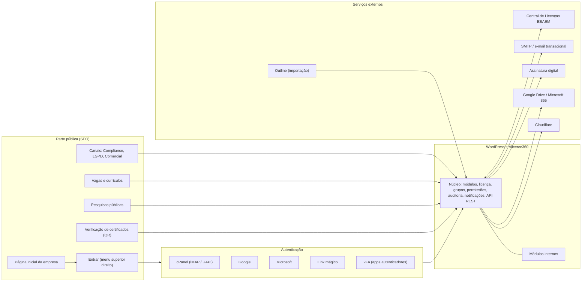
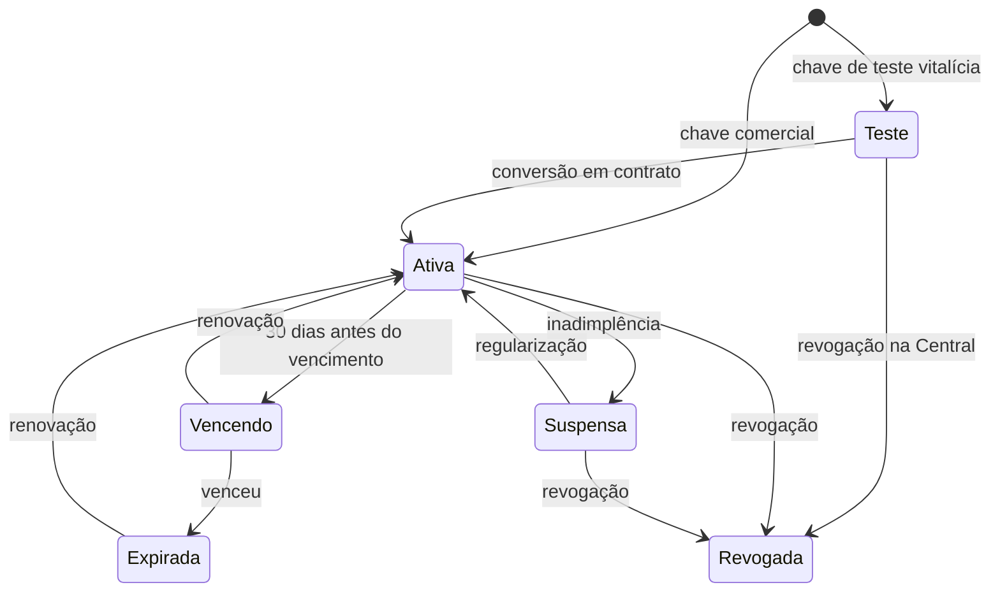
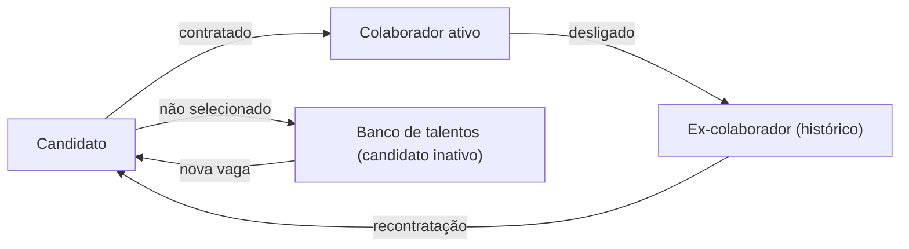
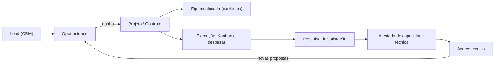
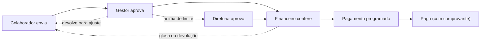
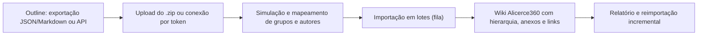

# Alicerce360 — Planejamento do Plugin de Intranet Corporativa para WordPress

> **Produto:** **Alicerce360** · **Comercialização e licenciamento:** **EBAEM** (Administradora)
> **Status:** proposta para aprovação · **Versão:** 0.2 · **Data:** 03/10/2026
> **Objetivo deste documento:** consolidar escopo, arquitetura e ideias antes de qualquer código. Marque em cada item o que aprova, ajusta ou descarta.

### Glossário

| Termo | Significado |
|---|---|
| **Alicerce360** | O plugin de intranet (produto). |
| **EBAEM / Administradora** | Empresa que vende, licencia, distribui atualizações e opera a hospedagem (WHM). |
| **Central de Licenças Alicerce360** | Outro plugin, a ser desenvolvido separadamente, instalado no site da EBAEM, que emite, controla e revoga licenças. |
| **Cliente** | Empresa que contrata e usa o Alicerce360 para seus colaboradores. |
| **Público externo** | Candidatos a vagas, clientes do Cliente (pesquisas e atestados), denunciantes e titulares de dados (canais públicos). |

### Histórico de versões

| Versão | Mudanças |
|---|---|
| 0.1 | Planejamento inicial. |
| **0.2** | Nome **Alicerce360** e EBAEM como Administradora · **foco em hospedagem compartilhada WHM/cPanel** como produto distribuível (VPS como opção) · **licenciamento pela Central EBAEM** (chave de teste vitalícia revogável, prazos de uso) · **barra superior fixa com megamenu** · **canais públicos de Compliance, LGPD e Comercial com tickets e protocolo** · página pública carregada com canais, políticas e funcionalidades · feed com opção "só publicar" ou "publicar e enviar e-mail a todos" · **regras de progressão nos treinamentos** (pré-requisitos, quizzes entre módulos, prova final, pesquisa de satisfação) e **certificados com QR Code** · **pesquisas de satisfação externas/públicas** com listas de destinatários · **atestados de capacidade técnica** com assinatura por certificado digital · **CRM comercial restrito** com Kanban e funil · **prestação de contas e reembolsos** com aprovação gestor → financeiro · **banco de talentos, currículos e relatórios de RH** · **vagas públicas e candidaturas** com LinkedIn · **importação de bases do Outline** · 2FA com aplicativos autenticadores de mercado. |

---

## Sumário

1. [Resposta curta e pontos de atenção](#1-resposta-curta-e-pontos-de-atenção)
2. [Visão do produto](#2-visão-do-produto)
3. [Arquitetura técnica](#3-arquitetura-técnica)
4. [Implantação, distribuição e licenciamento](#4-implantação-distribuição-e-licenciamento)
5. [Identidade, login e acesso](#5-identidade-login-e-acesso)
6. [Estrutura organizacional, grupos e permissões](#6-estrutura-organizacional-grupos-e-permissões)
7. [Navegação: barra superior fixa e megamenu](#7-navegação-barra-superior-fixa-e-megamenu)
8. [Catálogo de módulos](#8-catálogo-de-módulos)
9. [Templates visuais (mínimo 8) e personalização](#9-templates-visuais-mínimo-8-e-personalização)
10. [Página inicial pública, canais e SEO](#10-página-inicial-pública-canais-e-seo)
11. [Wiki própria e importação do Outline](#11-wiki-própria-e-importação-do-outline)
12. [Área de downloads restrita — critérios de segurança](#12-área-de-downloads-restrita--critérios-de-segurança)
13. [Painel de segurança do ambiente](#13-painel-de-segurança-do-ambiente)
14. [LGPD, logs e evidências](#14-lgpd-logs-e-evidências)
15. [O que as intranets de mercado têm (e o que absorvemos)](#15-o-que-as-intranets-de-mercado-têm-e-o-que-absorvemos)
16. [Requisitos não funcionais](#16-requisitos-não-funcionais)
17. [Roadmap em fases](#17-roadmap-em-fases)
18. [Decisões pendentes (preciso da sua resposta)](#18-decisões-pendentes-preciso-da-sua-resposta)
19. [Ideias novas para aprovação](#19-ideias-novas-para-aprovação)
20. [Próximos passos](#20-próximos-passos)
- [Anexo A — Estrutura do plugin](#anexo-a--estrutura-do-plugin)
- [Anexo B — Modelo de dados (resumo)](#anexo-b--modelo-de-dados-resumo)
- [Anexo C — Mapeamento normativo e legal](#anexo-c--mapeamento-normativo-e-legal)
- [Anexo D — Contrato de integração com a Central de Licenças EBAEM](#anexo-d--contrato-de-integração-com-a-central-de-licenças-ebaem)

---

## 1. Resposta curta e pontos de atenção

**Sim, é viável.** Todo o escopo cabe em um plugin WordPress modular, distribuível em hospedagem compartilhada WHM/cPanel, com módulos ativáveis por licença, templates selecionáveis e administração própria. Pelo porte, a entrega será **em fases**, cada uma utilizável.

Pontos que moldam o desenho:

| # | Ponto | Como resolvemos |
|---|---|---|
| 1 | **Hospedagem compartilhada (WHM com vários cPanels) é o alvo principal.** Não há Docker, Node.js nem WebSocket, e cada conta tem limites de CPU, memória, processos e envio de e-mails. | Plugin **100% PHP + MySQL**, sem serviços externos obrigatórios; tarefas pesadas em fila com cron real; chat por *polling* leve; vídeos hospedados fora (YouTube/Vimeo/Panda/Bunny). Recursos que exigem servidor próprio viram **extras do plano VPS**. |
| 2 | **Roundcube não tem API de login.** | Login com o e-mail do cPanel por **IMAP** (no mesmo servidor, sem credencial privilegiada) ou pela **API UAPI do cPanel** (`Email::verify_password`). |
| 3 | **Nunca usar o token do WHM dentro das instalações dos clientes.** Se um WordPress fosse comprometido, todas as contas do servidor ficariam expostas. | Cada instalação usa apenas credenciais da própria conta cPanel. Integrações de nível servidor (segurança, provisionamento) rodam por um **agente da EBAEM no servidor**, fora do WordPress. |
| 4 | **Outline:** licença BSL 1.1 e exigência de servidor próprio. | **Wiki própria** no Alicerce360 + **importador de bases do Outline** (arquivo de exportação ou API). Conector SSO com Outline fica opcional para quem tem VPS. |
| 5 | **Assinatura com certificado digital (ICP-Brasil)** não se resolve só com PHP em hospedagem compartilhada. | Duas rotas: (a) o signatário baixa, assina com seu certificado ICP-Brasil ou gov.br e envia de volta, com verificação e guarda na plataforma; (b) integração com plataformas de assinatura. |
| 6 | **"Log de tudo" × anonimato do canal de denúncias.** | Logs completos em geral, mas o canal de denúncias anônimo **não registra IP nem dispositivo** e remove metadados dos anexos. |
| 7 | **Licença GPL do WordPress.** | O controle comercial (licença, prazo, revogação) funciona via Central EBAEM e entrega de atualizações. O valor está em atualizações, suporte, hospedagem e serviços, como é padrão no mercado. |

---

## 2. Visão do produto

**Alicerce360 é uma intranet de gestão corporativa com foco em Qualidade, Compliance e normas ISO.** Reúne comunicação interna, rede social, treinamentos com evidência, gestão documental, tarefas, gestão de pessoas e talentos, atendimento de canais públicos (Compliance, LGPD, Comercial), CRM, atestados técnicos e prestação de contas em um único ambiente responsivo, com a marca de cada cliente.

**Diferencial:** cada ação relevante gera **evidência auditável** (aceites, leituras, treinamentos, provas, certificados com QR Code, protocolos, aprovações, assinaturas, downloads, versões), pronta para auditoria ISO e para defesa jurídica ou trabalhista.

**Públicos:**

| Público | O que precisa |
|---|---|
| Colaborador | Ver as suas pendências, avisos, treinamentos, tarefas, documentos, chat e pessoas; pedir reembolsos; manter o currículo. Simples e no celular. |
| Gestor de área | Publicar para a área, acompanhar a equipe, gerir o Kanban, aprovar reembolsos. |
| Qualidade / Compliance / Jurídico / Encarregado (DPO) | Documentos, termos, treinamentos, NC/CAPA, tickets de Compliance e LGPD, atestados, relatórios e evidências. |
| RH | Pessoas, currículos, banco de talentos, vagas, candidatos, relatórios por projeto e competência. |
| Comercial | CRM, funil, tickets do canal comercial, atestados e acervo técnico. |
| Financeiro | Conferência e pagamento de reembolsos e adiantamentos, relatórios. |
| Administrador do cliente | Marca, templates, menus, módulos, grupos, usuários, integrações e segurança, sem usar o `wp-admin`. |
| Auditor | Somente leitura, temporário, sobre as evidências liberadas. |
| Público externo | Candidatos, clientes do cliente, denunciantes e titulares de dados, pelas páginas públicas. |
| EBAEM (Administradora) | Implantar, licenciar, atualizar, monitorar e dar suporte a todos os clientes. |

---

## 3. Arquitetura técnica

### 3.1 Princípios

1. **Plugin núcleo + módulos ativáveis.** Cada funcionalidade tem chave liga/desliga, dependências declaradas e permissões próprias. Módulo desligado (ou não incluído na licença) não carrega código nem aparece no menu.
2. **Distribuível e autossuficiente.** Só PHP + MySQL; dependências Composer embutidas e **com namespace isolado** (PHP-Scoper/Strauss) para não conflitar com outros plugins do cliente; nenhuma dependência de Node.js, Docker ou serviço externo para funcionar.
3. **Independente do tema.** A área logada é renderizada pelo próprio Alicerce360. A parte pública usa blocos Gutenberg próprios.
4. **Dados de alto volume em tabelas próprias** (logs, chat, progresso, aceites, tickets, despesas). Conteúdo editorial em *Custom Post Types* (revisões e editor nativos).
5. **API REST única** (`/wp-json/alicerce360/v1/...`) para front-end, PWA e integrações.
6. **Leve para hospedagem compartilhada:** filas em segundo plano (Action Scheduler + cron real), processamento em lotes pequenos, *endpoint* de *polling* enxuto, cache de objeto quando disponível.
7. **Segurança por padrão:** toda rota verifica permissão; segredos criptografados (libsodium) com chave fora do banco.

### 3.2 Stack

| Camada | Tecnologia |
|---|---|
| Servidor | PHP 8.2+ (recomendado 8.3), WordPress 6.6+, MySQL 8 / MariaDB 10.6+ |
| Área logada e Central de Administração | React + TypeScript (`@wordpress/scripts`), PWA instalável |
| Parte pública | PHP renderizado no servidor + blocos Gutenberg (SEO) |
| Fila e agendamentos | Action Scheduler + cron real do cPanel |
| PDFs | mPDF ou Dompdf + QR Code (certificados, comprovantes, relatórios, currículos padronizados) |
| Leitura de códigos | Câmera do celular no navegador (QR Code e código de barras de notas fiscais) |
| Tempo real | *Polling* adaptativo (padrão) · Pusher/Ably ou Soketi/Centrifugo (VPS) |
| Busca | MySQL FULLTEXT (padrão) · Meilisearch (VPS) |
| Ícones | Biblioteca livre (ex.: Lucide ou Tabler) |

### 3.3 Visão geral



### 3.4 Camadas de hospedagem

| Recurso | **WHM compartilhado (principal)** | VPS dedicada (opcional) |
|---|---|---|
| Todos os módulos funcionais | ✅ | ✅ |
| Chat | *Polling* adaptativo (3 s com a conversa aberta, 15–30 s em segundo plano, pausa com a aba oculta) | Tempo real (WebSocket) |
| Busca | MySQL FULLTEXT | Meilisearch |
| Cache | Object cache se a EBAEM disponibilizar (Redis/Memcached por conta) | Redis |
| Antivírus de *upload* | ClamAV do servidor (se instalado no WHM) | ClamAV |
| Wiki | Própria + importação do Outline | Idem + conector SSO com Outline |
| Edição colaborativa em tempo real | — | ✅ (fase 4) |
| Painel de segurança | Itens da aplicação + agente do servidor EBAEM | Completo |

### 3.5 Recomendações para o WHM da EBAEM

**Pacotes de hospedagem por porte** (valores iniciais, a calibrar com testes de carga no cliente piloto):

| Pacote | Usuários | CPU (LVE) | Memória | Processos de entrada (EP) | Disco |
|---|---|---|---|---|---|
| P | até 50 | 1 núcleo | 1 GB | 20 | 10–20 GB |
| M | até 200 | 2 núcleos | 2 GB | 40 | 30–50 GB |
| G | até 500 | 4 núcleos | 4 GB | 60 | 50–100 GB |
| > 500 | — | VPS dedicada | — | — | — |

**Outras configurações:**
- **Cron real** por conta (a cada 1–5 min) e `DISABLE_WP_CRON`.
- **Limite de e-mails por hora** (WHM: máximo de e-mails por domínio por hora) compatível com o porte. Para "e-mail para todos" em clientes grandes, recomendamos **relay SMTP transacional** (Amazon SES, Brevo, Postmark), porque a fila respeita o limite e, por exemplo, 400 e-mails a 200/h levariam 2 h.
- **PHP-FPM** com OPcache; PHP 8.3; `memory_limit` 256M.
- **Vídeos fora do servidor** (YouTube não listado, Vimeo, Panda Video, Bunny Stream).
- **Anexos grandes**: opção de armazenamento compatível com S3 (Backblaze, Wasabi, AWS) para não estourar a cota.
- **AutoSSL** ativo; **DKIM/SPF** gerenciados pelo cPanel; **DMARC** publicado.
- **Backup** do WHM ou JetBackup, com retenção e teste de restauração.

---

## 4. Implantação, distribuição e licenciamento

### 4.1 Modelos

| Modelo | Como funciona | Indicação |
|---|---|---|
| **A. Conta cPanel por cliente no WHM da EBAEM** | Cada cliente tem sua conta cPanel com seu WordPress + Alicerce360, em subdomínio (`intranet.cliente.com.br`) ou domínio próprio. | **Padrão** (pequenos e médios clientes). Isolamento por conta, e-mail do cliente no mesmo servidor. |
| B. VPS dedicada | Mesma instalação, servidor exclusivo, com os extras da [§3.4](#34-camadas-de-hospedagem). | Clientes grandes ou com exigências específicas. |
| C. Hospedagem do próprio cliente | O cliente instala o plugin em sua hospedagem, com licença EBAEM. | Revenda/distribuição. Requisitos mínimos publicados. |

Recomendamos **intranet separada do site institucional** do cliente (outra instalação), para isolar riscos e preservar o SEO do site principal.

### 4.2 Provisionamento automatizado no WHM

Script da EBAEM, executado no servidor (nunca dentro do WordPress do cliente):

1. Cria a conta cPanel com o pacote adequado (API do WHM).
2. Instala o WordPress (WP Toolkit ou WP-CLI) e o Alicerce360.
3. Aplica *hardening*, cron real, SSL, SMTP e a caixa `intranet@` para envios.
4. Registra a instalação na **Central de Licenças** e ativa a chave.
5. Abre o **assistente de configuração** para o cliente.

**Atualização em massa:** atualizações entregues pela Central de Licenças (painel do WordPress de cada cliente) e, para a EBAEM, aplicação em lote no WHM via WP Toolkit ou WP-CLI.

### 4.3 Assistente de configuração (primeiro acesso)

1. Dados da empresa (razão social, CNPJ, endereço, contatos, redes, logos, **encarregado de dados/DPO**).
2. Template e cores (pré-visualização ao vivo).
3. Módulos (dentro do que a licença permite).
4. Métodos de login, 2FA e domínios de e-mail permitidos.
5. Estrutura: unidades, áreas/grupos, cargos.
6. Canais públicos (Compliance, LGPD, Comercial) e caixas de e-mail de entrada.
7. Importação de usuários (contas de e-mail do cPanel, CSV, Google, Microsoft).
8. Políticas iniciais a partir de modelos editáveis (Privacidade/LGPD, Compliance/Anticorrupção, Código de Conduta, Uso de IA, Segurança da Informação, Termos de Uso).
9. Revisão e publicação, com **kit de lançamento** (e-mail, cartaz com QR Code, tutorial).

### 4.4 Licenciamento pela Central EBAEM

A **Central de Licenças Alicerce360** é um projeto separado (plugin no site da EBAEM). Este plugin (cliente) se comunica com ela conforme o [Anexo D](#anexo-d--contrato-de-integração-com-a-central-de-licenças-ebaem).

**Tipos de licença:**

| Tipo | Prazo | Observações |
|---|---|---|
| **Teste vitalícia** | Sem vencimento | **Revogável a qualquer momento** na Central. Limites configuráveis (ex.: nº de usuários, módulos, aviso "Ambiente de avaliação"). |
| Mensal / anual | Data de vencimento | Renovação na Central. |
| Por prazo definido | Data de vencimento | Projetos e pilotos. |

**Cada licença define:** plano, módulos liberados, limite de usuários ativos, domínio(s) autorizados (inclui domínio de homologação), data de vencimento (ou nenhuma) e canal de atualizações.

**Funcionamento:**
- Ativação vincula a chave ao domínio e a um identificador único da instalação.
- A Central devolve um **token assinado digitalmente** (Ed25519). O plugin traz a chave pública e valida o token **mesmo sem internet**, o que impede falsificação local.
- Verificação diária com a Central; se ela estiver inacessível, há **tolerância de 15 dias** (configurável).
- Revogação, suspensão ou renovação na Central valem na próxima verificação, ou na hora por um *ping* da Central.



**Comportamento por estado (sugestão):**

| Estado | Comportamento |
|---|---|
| Teste / Ativa | Normal, dentro dos módulos e limites da licença. |
| Vencendo | Aviso aos administradores (30/15/7/1 dias). |
| Expirada / Suspensa | **Modo somente leitura**: todos consultam e exportam, ninguém cria conteúdo novo; atualizações bloqueadas. |
| Revogada | Acesso limitado aos administradores para **exportar dados** (obrigação LGPD e preservação de evidências ISO). Nenhum dado é apagado automaticamente. |

> Por que não bloquear tudo: o cliente precisa continuar acessando evidências (aceites, treinamentos, atestados) e atender titulares de dados. Bloqueio total gera risco jurídico para a EBAEM. **Decisão sua na [§18](#18-decisões-pendentes-preciso-da-sua-resposta).**

### 4.5 Planos (sugestão para validar)

| Plano | Módulos |
|---|---|
| **Essencial — Comunicação e Canais** | Página pública com canais e políticas, login com 2FA, megamenu, home personalizável, feed, avisos, calendário, links, diretório, termos com aceite, área do usuário, downloads restritos, **canais de Compliance e LGPD com tickets**, 4 templates. |
| **Profissional — Pessoas e Colaboração** | Essencial + treinamentos com regras e certificados QR, pesquisas internas e externas, tarefas/Kanban, chat, área social, grupos/páginas por área, wiki + importação Outline, **banco de talentos e vagas**, Google Drive/Microsoft 365, todos os templates. |
| **Gestão — Enterprise** | Profissional + **CRM**, **canal comercial**, **atestados de capacidade técnica**, **prestação de contas/reembolsos**, projetos e alocação, controle de documentos ISO, módulos de Qualidade (NC/CAPA, auditorias, indicadores, riscos), matriz de competências, portal do auditor, painel de segurança avançado, *white-label*. |

Módulos avulsos (ex.: CRM ou Reembolsos no plano Profissional) podem ser liberados por licença.

---

## 5. Identidade, login e acesso

### 5.1 Métodos de login

| Método | Como funciona | Observações |
|---|---|---|
| **E-mail cPanel via IMAP** *(padrão no WHM)* | Autentica no servidor de e-mail (TLS, porta 993). Se o e-mail estiver no mesmo servidor, a conexão é local. | Sem credencial privilegiada; senha nunca armazenada. O plugin limita tentativas antes de consultar o servidor, para não acionar o bloqueio do cPHulk/CSF. |
| **E-mail cPanel via UAPI** | `Email::verify_password` com *token* de API **da própria conta cPanel do cliente**. | Permite **sincronizar a lista de contas** (`Email::list_pops`). Token criptografado, com validade e rotação. |
| **Google** | OAuth 2.0/OIDC, restrito ao domínio. | Clientes com Google Workspace. |
| **Microsoft** | Entra ID/OIDC, restrito ao *tenant*. | Clientes com Microsoft 365. |
| **Link mágico** | Link de uso único por e-mail (10–15 min). | Prova acesso à caixa corporativa, inclusive Roundcube. |
| **Login próprio** | Usuário e senha da intranet. | Terceiros e quem não tem e-mail corporativo. |
| **Matrícula + PIN / QR Code** | Equipes operacionais e quiosques. | Sessão curta e logout automático. |
| **Candidatos (área pública)** | Link mágico ou "Entrar com LinkedIn". | O LinkedIn fornece só nome, e-mail e foto. O histórico profissional vem do currículo enviado ou do preenchimento. |

**Roundcube:** atalho "Webmail" no menu. Login automático no Roundcube exigiria guardar a senha do e-mail e **não é recomendado**.

### 5.2 Duplo fator de autenticação (2FA)

- **TOTP (RFC 6238)**, compatível com os aplicativos de mercado: **Google Authenticator, Microsoft Authenticator, Authy, 1Password, Bitwarden, FreeOTP**. Configuração por QR Code.
- **Passkeys/WebAuthn** (biometria do celular, Windows Hello, chaves físicas).
- **Códigos de recuperação** (10, de uso único).
- E-mail como segundo fator: opcional e desaconselhado para administradores.
- **Dispositivo confiável** por até 30 dias (configurável).
- **Obrigatoriedade** por papel, grupo ou nível de acesso (ex.: obrigatório para administradores, financeiro, RH, Compliance e quem acessa documentos confidenciais).
- Redefinição do 2FA pelo administrador, com registro em log.

### 5.3 Segurança do acesso

- Provisionamento por pré-cadastro, convite ou criação no primeiro login (domínios permitidos, com aprovação opcional).
- **Desligamento:** bloqueio imediato, encerramento das sessões, transferência de tarefas, preservação dos registros e **mudança do perfil para "ex-colaborador"** no banco de talentos ([§8.14](#814-pessoas-currículos-e-banco-de-talentos-rh--f2)).
- Sessões com tempo de inatividade, lista de dispositivos, "sair de todos".
- Limite de tentativas, bloqueio progressivo, CAPTCHA invisível (Cloudflare Turnstile), alerta de novo dispositivo ou país.

### 5.4 A intranet como provedor de login único (OIDC) — opcional

O Alicerce360 pode atuar como provedor **OpenID Connect**. Plataformas compatíveis (Outline, Nextcloud, Moodle, Metabase, alguns ERPs) passam a aceitar o login da intranet: o usuário clica e entra autenticado, sem *magic link*. Ao desligar alguém, o acesso cai em todas.

---

## 6. Estrutura organizacional, grupos e permissões

### 6.1 Entidades

- **Empresa** → **Unidades/Filiais** → **Áreas/Grupos** (Operações, Jurídico, Administrativo, Qualidade, RH, Financeiro, Comercial, TI…) → **Cargos**.
- **Projetos/Contratos** como entidade comum ([§8.21](#821-projetos-e-contratos-base-comum-novo--f3)), ligando clientes, equipes, despesas, pesquisas e atestados.
- **Tipos de grupo:** departamentais, projetos/comitês, comunidades e **dinâmicos** (membros por regra, ex.: "cargo = Técnico e unidade = Fábrica 2").
- **Visibilidade:** aberto, privado ou secreto. **Entrada:** livre, por solicitação, por convite ou por regra.
- **Página de cada área** (mini-site): capa, membros, feed, documentos, wiki, Kanban, calendário, links, canal de chat e, para as áreas responsáveis, **a fila de atendimentos dos canais** (ex.: o Jurídico vê os tickets de Compliance; o Encarregado vê os de LGPD; o Comercial vê os do canal comercial).

### 6.2 Papéis globais (sugestão)

| Papel | Resumo |
|---|---|
| **Superadministrador EBAEM** | Licença, `wp-admin`, integrações técnicas, suporte. |
| Administrador da intranet | Marca, templates, menus, módulos, usuários, grupos, integrações, segurança. |
| Gestor de Comunicação | Feed, avisos, home, calendário, banners, e-mails em massa. |
| Gestor da Qualidade | Documentos, termos, treinamentos, competências, NC/CAPA, auditorias, pesquisas, atestados. |
| Comitê de Compliance | Tickets do canal de Compliance (com proteção contra conflito de interesses). |
| Encarregado de Dados (DPO) | Tickets do canal LGPD, relatórios de privacidade. |
| Gestor de RH / Recrutador | Pessoas, currículos, banco de talentos, vagas, candidatos, relatórios. |
| Comercial | CRM, canal comercial, acervo de atestados. |
| Financeiro | Prestação de contas, adiantamentos, pagamentos, relatórios. |
| Gestor de Área | Seus grupos: publicações, membros, Kanban, documentos, **aprovação de reembolsos da equipe**. |
| Colaborador | Uso padrão. |
| Auditor | Somente leitura, com prazo, no escopo liberado. |
| Convidado/Externo | Terceiros, acesso restrito e com expiração. |

### 6.3 Permissões granulares

Matriz configurável **módulo × ação × papel/grupo** (ver, criar, editar, publicar, aprovar, moderar, excluir, exportar, administrar). Exemplo:

| Ação | Colaborador | Gestor de Área | Qualidade | RH | Comercial | Financeiro | Auditor | Admin |
|---|:-:|:-:|:-:|:-:|:-:|:-:|:-:|:-:|
| Ler documentos da sua área | ✅ | ✅ | ✅ | ✅ | ✅ | ✅ | ✅* | ✅ |
| Publicar no feed principal com e-mail a todos | ❌ | ⚙️ | ⚙️ | ⚙️ | ❌ | ❌ | ❌ | ✅ |
| Aprovar reembolso | ❌ | equipe | ❌ | ❌ | ❌ | ✅ | ❌ | ⚙️ |
| Consultar currículos e relatórios de RH | o seu | equipe (resumo) | ⚙️ | ✅ | currículo padronizado | ❌ | ❌ | ✅ |
| Acessar CRM | ❌ | ❌ | ❌ | ❌ | ✅ | ❌ | ❌ | ⚙️ |
| Ver tickets de Compliance | ❌ | ❌ | ❌ | ❌ | ❌ | ❌ | ❌ | ❌** |
| Configurar template e menus | ❌ | ❌ | ❌ | ❌ | ❌ | ❌ | ❌ | ✅ |

✅ permitido · ❌ negado · ⚙️ configurável · \* somente no escopo e período liberados · \*\* apenas o Comitê de Compliance, nem o administrador vê por padrão.

---

## 7. Navegação: barra superior fixa e megamenu

### 7.1 Barra superior (desktop)

```
[Logo] Início | Comunicação ▾ | Pessoas ▾ | Aprendizagem ▾ | Documentos ▾ | Áreas ▾ | Gestão ▾ | Serviços ▾ | [menus personalizados]   🔍  🔔  💬  [Avatar ▾]
```

- **Menus fixos das funcionalidades homologadas:** aparecem automaticamente quando o módulo está ativo e o usuário tem permissão. O administrador do cliente **não pode remover** um menu fixo enquanto o módulo estiver ativo, mas pode **reordenar e renomear** (sugestão, ver [§18](#18-decisões-pendentes-preciso-da-sua-resposta)).
- **Megamenu por padrão:** cada menu abre um painel com colunas, **ícones**, descrição curta de cada item, um bloco de destaque (aviso, banner ou atalho) e contadores de pendências (ex.: "Treinamentos (2)").
- **Menus personalizados:** o administrador cria menus, submenus e links (internos ou externos) com **ícone**, descrição, abertura em nova aba e **visibilidade por grupo, papel ou unidade**. Editor de arrastar e soltar com seletor de ícones.
- **Barra fixa ao rolar** (opção), busca global sempre acessível, sino de notificações, chat e menu do usuário (Meu perfil, Minhas pendências, Meus reembolsos, Segurança/2FA, Sair).

**Sugestão de agrupamento dos menus fixos:**

| Menu | Itens (quando ativos) |
|---|---|
| Comunicação | Feed, Avisos, Calendário, Pesquisas, Galerias |
| Pessoas | Diretório, Organograma, Aniversariantes, Reconhecimentos, Vagas internas |
| Aprendizagem | Meus treinamentos, Catálogo, Trilhas, Certificados |
| Documentos | Biblioteca, Wiki, Downloads, Políticas e Termos |
| Áreas | Páginas de cada grupo do usuário |
| Gestão | Tarefas/Kanban, Projetos, Qualidade, Prestação de contas, Atestados, CRM (conforme permissão) |
| Serviços | Links e sistemas, Solicitações, Canais, Webmail |

### 7.2 Celular

- Menu "hambúrguer" que abre os megamenus em **acordeão** com ícones.
- **Barra inferior fixa estilo aplicativo**: Início, Busca, Notificações, Chat, Perfil.
- Botão de ação rápida (ex.: "Novo reembolso", "Nova publicação"), conforme o perfil.

---

## 8. Catálogo de módulos

Fases: **F1** = MVP · **F2** · **F3** · **F4** (ver [§17](#17-roadmap-em-fases)). *(novo)* = sugestão além do pedido.

### 8.1 Home da intranet (painel personalizável) — F1

- Widgets: **Minhas pendências** (termos, treinamentos, leituras, tarefas, aprovações de reembolso), avisos, feed, agenda, aniversariantes, links rápidos, indicadores, novos colaboradores, enquete, banner.
- Home padrão por grupo/unidade/cargo; reorganização pelo colaborador, se permitido.

### 8.2 Feed de publicações — F1

**Ao publicar, o autor escolhe:**

| Opção | Efeito |
|---|---|
| **Somente no feed** | Aparece no feed principal (ou da área), sem e-mail. |
| **Feed + e-mail para todos** | Publica e envia e-mail com a identidade da empresa a todos os colaboradores ativos. |
| **Feed + e-mail para segmentos** | E-mail apenas para grupos, unidades ou cargos escolhidos. |
| + notificação *push* | Opcional em qualquer caso. |

- Destino: feed principal ou feed de uma ou mais áreas.
- Conteúdo: texto, imagens, galerias, vídeos, anexos, enquetes; agendamento, expiração, destaque fixo.
- Reações, comentários moderáveis, @menções, #tags; fluxo editorial opcional.
- **Permissão específica** para "e-mail a todos", para evitar excesso de e-mails.
- E-mail com resumo ou conteúdo completo + "ler na intranet"; fila respeita o limite por hora do WHM.
- Estatísticas: alcance, leituras, cliques do e-mail.

### 8.3 Avisos e alertas — F1

- Níveis Informativo, Importante e Crítico; faixa no topo, *pop-up* com confirmação obrigatória, e-mail, *push*, WhatsApp/SMS opcional.
- **"Li e estou ciente"** com registro, relatório de quem leu e quem não leu e reenvio automático para pendentes.

### 8.4 E-mails com identidade da empresa — F1

- Modelos HTML responsivos com logo, cores, rodapé (razão social, CNPJ, endereço, contatos, encarregado de dados) e assinatura.
- SMTP do cPanel (`intranet@cliente.com.br`) ou relay transacional.
- **Fila com limite por hora**, reprocessamento automático, painel de entregas e falhas.
- Verificação de SPF, DKIM e DMARC no painel de segurança.
- Resumo diário/semanal para conteúdos não obrigatórios.

### 8.5 Área social — F2

- Perfis, diretório, **organograma automático**, aniversariantes, tempo de casa, boas-vindas, **reconhecimentos/elogios** ligados aos valores da empresa, comunidades, galerias, classificados; gamificação opcional; moderação.

### 8.6 Chat — F2

- Conversas 1:1, grupos e canais por área; anexos, @menções, respostas, leitura e presença.
- *Polling* adaptativo em WHM; tempo real em VPS.
- Retenção configurável, mensagens editadas/excluídas preservadas na auditoria, exportação legal por perfil autorizado.

### 8.7 Calendário e reservas — F1 / F2

- Agendas global, por área e pessoal; recorrência; RSVP; lembretes; camadas automáticas (treinamentos, auditorias, vencimentos, feriados, aniversários); ICS; sincronização Google/Outlook.
- Reserva de salas, veículos e equipamentos com aprovação (F2).

### 8.8 Tarefas e Kanbans — F2

- **Quadros globais, por área/grupo e pessoais**; colunas configuráveis; limite de WIP.
- Cartões com responsáveis, prazo, prioridade, etiquetas, *checklist*, anexos, comentários, recorrência.
- **Tarefa de grupo compartilhada** (um conclui por todos) ou **individual em massa** (cada um conclui a sua, com acompanhamento).
- Visões Kanban, lista, calendário e **"Minhas tarefas"**; automações simples; modelos (5W2H, PDCA, Onboarding, Auditoria).
- Tarefas geradas por outros módulos (treinamento atrasado, documento a revisar, ação corretiva, atestado pendente).

### 8.9 Treinamentos (LMS) com regras de progressão — F2

**Estrutura:** cursos → módulos → aulas (vídeo externo, PDF, texto, link, arquivo) → atividades (quiz, prova, pesquisa). **Trilhas** de cursos (ex.: Integração, Compliance anual).

**Motor de regras de progressão** (configurável por curso, módulo e aula):

| Regra | Exemplo |
|---|---|
| **Sequencial** | Só abre a aula 2 depois de concluir a aula 1. |
| **Pré-requisito** | Módulo 3 exige os módulos 1 e 2 concluídos (ou outro curso concluído). |
| **Percentual de vídeo / tempo mínimo** | Aula concluída ao assistir 90% do vídeo ou permanecer 10 min. |
| **Quiz entre módulos (portão)** | Módulo 2 só abre com nota ≥ 70% no quiz do módulo 1. |
| **Prova final** | Nota mínima, nº de tentativas, tempo limite, banco de questões sorteadas. |
| **Liberação programada** | Módulo liberado N dias após a matrícula ou em data fixa. |
| **Aceite de termo** | Termo aceito antes de iniciar (ex.: confidencialidade). |
| **Presença** | Frequência mínima em turma presencial (check-in por QR Code). |
| **Pesquisa de satisfação obrigatória** | Avaliação de reação respondida antes de liberar o certificado. |
| **Reprovação** | Após esgotar as tentativas: bloqueio e aviso ao gestor, reabertura pelo administrador ou refazer o módulo. |

- **Atribuição** por grupo, unidade, cargo ou pessoa, com prazo e **reciclagem periódica** automática.
- **Logs das aulas**: início, fim, tempo, percentual do vídeo, tentativas, notas e respostas.
- **Provas e quizzes**: múltipla escolha, V/F, associação, ordenação, dissertativa com correção manual; embaralhamento; *feedback* por questão (opcional).
- **Treinamentos presenciais**: turmas, instrutor, lista de presença por QR Code.
- **Avaliação de eficácia** pelo gestor após X dias (ISO 9001 7.2).
- Relatórios por pessoa, área, curso e período; exportação Excel/PDF; alertas de atraso.
- SCORM 1.2/xAPI (F3).

### 8.10 Certificados e declarações com QR Code — F2

- Emissão automática quando **todas as regras do curso** forem cumpridas (aulas obrigatórias, quizzes, prova final, pesquisa de satisfação, presença).
- Tipos: **certificado de conclusão**, **declaração de participação** (sem prova) e **atestado de treinamento** (presencial).
- PDF com modelo editável (logo, assinaturas, carga horária, conteúdo programático no verso, instrutor, validade).
- **QR Code + código único** que abre a **página pública de verificação**: mostra nome, curso, carga horária, data, validade e situação (válido, vencido ou revogado), sem expor outros dados pessoais.
- Revogação com motivo, reemissão com histórico, envio por e-mail e "Meus certificados".

### 8.11 Pesquisas de satisfação (internas, externas e públicas) — F2

- **Construtor:** NPS (0–10), CSAT (1–5), CES, escala Likert, múltipla escolha, texto, matriz, ranking, data; páginas; obrigatoriedade; **lógica condicional**; identidade visual.
- **Públicos:**
  - Interno (grupos, unidades, cargos);
  - **Listas externas**: importação de CSV (clientes, fornecedores, parceiros) ou contatos do CRM/projetos;
  - **Link público aberto** (qualquer pessoa responde);
  - **QR Code** para eventos e pontos de atendimento;
  - **Incorporação** no site.
- **Envio por e-mail com link único** por destinatário (controle de quem respondeu, lembretes automáticos, uma resposta por link).
- Modos: **anônima** ou **identificada**.
- **Relatórios** em tempo real, NPS calculado, segmentação por cliente, projeto e período, exportação, série histórica alimentando os **indicadores** (ISO 9001 9.1.2 — satisfação do cliente).
- **Usos prontos:** avaliação de reação de treinamento, satisfação pós-projeto (disparo automático), clima interno/eNPS, pesquisa com fornecedores.
- **LGPD:** texto de privacidade, descadastro (*opt-out*), anonimização; proteção antifraude (Turnstile, limite por IP no link público).

### 8.12 Políticas e termos com aceite — F1

- Modelos editáveis: Código de Conduta, Compliance/Anticorrupção, Privacidade/LGPD, Uso de IA, Segurança da Informação, Termos de Uso, Confidencialidade, Assédio.
- **Versões com hash** (SHA-256); nova versão relevante exige novo aceite; **bloqueio** opcional até o aceite.
- **Registro do aceite**: usuário, versão, hash, data/hora, IP, dispositivo, método de autenticação; confirmação opcional por código (OTP).
- Comprovante em PDF; painel de % de aceite por política e área; cobrança automática; recusa com justificativa.
- **Versões públicas** das políticas de Privacidade e Compliance publicadas na página pública ([§10](#10-página-inicial-pública-canais-e-seo)).

> Aceites eletrônicos entre particulares têm base no art. 10, §2º, da MP 2.200-2/2001. O jurídico do cliente deve validar textos e método.

### 8.13 Área do usuário — F1

- Meu perfil, Minhas pendências, Meus termos, Meus treinamentos e certificados, Minhas tarefas, **Meus reembolsos**.
- **Meu currículo e qualificações** (formação, experiências, competências, certificações, registros profissionais, NRs, idiomas, cursos externos, anexos, validade com alerta de vencimento), com validação pelo RH.
- Privacidade (ver e exportar meus dados); Segurança (2FA, *passkeys*, sessões).

### 8.14 Pessoas, currículos e banco de talentos (RH) — F2

**Base única de pessoas com ciclo de vida:**



- **Currículo estruturado:** formação, experiências, competências (com nível), certificações (com validade), idiomas, registros profissionais (CREA, CAU, OAB, CRC…), cursos (internos automáticos + externos), **histórico de projetos** (alocações internas automáticas + projetos anteriores), LinkedIn, arquivo do currículo.
- **Alocação em projetos:** colaborador × projeto × cliente × função × período, alimentada pelo módulo Projetos ([§8.21](#821-projetos-e-contratos-base-comum-novo--f3)).
- **Consultas e relatórios do RH**, com filtros combináveis:
  - por **projeto** e cliente;
  - por **competência**, **qualificação**, **certificação** (válida/vencida) e **formação**;
  - por **situação**: ativo, ex-colaborador, candidato, banco de talentos;
  - por unidade, cargo e área.
- **Exportação** Excel/PDF e **currículo padronizado da empresa** *(novo)*: gera currículos no modelo da empresa, individualmente ou em lote, para propostas e licitações (equipe técnica), com versão **sem dados pessoais** para o Comercial.
- **Acesso:** RH completo; gestores com resumo da equipe; Comercial só currículo padronizado; colaborador só o seu.
- **LGPD** ([§14.3](#143-candidatos-ex-colaboradores-e-banco-de-talentos)): aviso de privacidade, retenção por situação, consentimento para o banco de talentos, renovação periódica, exclusão a pedido, dados sensíveis segregados.

### 8.15 Recrutamento e vagas (área pública) — F2

- **Vagas publicadas pelo RH**: título, descrição, requisitos, local, modalidade (presencial, híbrido, remoto), tipo (CLT, PJ, estágio), faixa salarial opcional, vaga afirmativa/PCD, prazo, status (aberta, pausada, encerrada).
- **Página pública de vagas** com filtros e boa indexação: dados estruturados **`JobPosting`** (aparece no Google Vagas), compartilhamento em redes, vagas internas (só para colaboradores) ou externas.
- **Candidatura:** dados mínimos, currículo (PDF/DOCX), **URL do perfil do LinkedIn**, perguntas de triagem por vaga (inclusive eliminatórias), consentimento LGPD.
- **Portal do candidato** (login por link mágico ou LinkedIn): "Minhas candidaturas", status, atualizar currículo, sair do banco de talentos.
- **Envio espontâneo** para o banco de talentos, sem vaga específica.
- **Funil por vaga (Kanban):** Recebidos → Triagem → Entrevista RH → Entrevista gestor → Teste → Proposta → Contratado / Não selecionado / Banco de talentos. Avaliações (*scorecards*), notas, etiquetas, agendamento de entrevistas, modelos de e-mail (inclusive retorno aos não selecionados).
- **Contratado → colaborador:** cria o usuário e dispara o onboarding, mantendo o histórico.
- Relatórios: tempo de contratação, origem dos candidatos, conversão por etapa.
- Proteção: Turnstile, *honeypot*, antivírus e validação de tipo dos arquivos.

### 8.16 Gestão documental e controle de informação documentada (ISO) — F1 / F3

- Bibliotecas por área, metadados, versões, *check-out/check-in*, visualização no navegador, busca no texto dos PDFs.
- (F3) **Fluxo de aprovação** elaborador → revisor → aprovador, **lista mestra**, cópia controlada × não controlada, **leitura obrigatória com confirmação**, revisão periódica, obsoletos retidos.

### 8.17 Wiki — F2

Ver [§11](#11-wiki-própria-e-importação-do-outline).

### 8.18 Hub de links e plataformas — F1

- Cartões com ícone para ERP, CRM externo, ponto, webmail etc.; visibilidade por grupo; favoritos; cliques; SSO quando suportado; status de disponibilidade (F3).

### 8.19 Busca global — F2

- Pessoas, publicações, documentos (inclusive PDFs), wiki, cursos, links, tarefas, vagas e (com permissão) tickets e CRM — **sempre respeitando permissões**.

### 8.20 Central de canais públicos e tickets (Compliance, LGPD e Comercial) — F1

Cada canal é **habilitável**, tem **página pública explicativa** e é atendido pela **área responsável** dentro da intranet.

| Canal | Página pública explica | Entradas | Responsável | Protocolo |
|---|---|---|---|---|
| **Compliance / Denúncias** | O que pode ser relatado, garantia de anonimato e de não retaliação, como acompanhar. | Formulário público (anônimo ou identificado), caixa `compliance@`, usuários logados. | Comitê de Compliance (página da área Jurídico/Compliance). | `COMP-2026-000123` |
| **Privacidade / LGPD** | Direitos do titular (LGPD, art. 18), contato do encarregado, prazos, como acompanhar. | Formulário público, caixa `privacidade@` ou `dpo@`. | Encarregado de Dados (DPO). | `LGPD-2026-000045` |
| **Comercial / Contato** | Como falar com a empresa, prazo de retorno. | Formulário público e **e-mails enviados ao contato/comercial** (`comercial@`, `contato@`). | Área Comercial. | `COM-2026-000310` |
| Ouvidoria/SAC *(opcional)* | Reclamações e sugestões. | Formulário e e-mail. | Área definida. | `OUV-2026-…` |

**Funcionamento:**
- **Protocolo + chave de acesso**: o relator acompanha em **"Acompanhar protocolo"** na página pública, mesmo anônimo, e troca mensagens com a empresa.
- **E-mails de entrada:** o Alicerce360 lê as caixas configuradas (IMAP, a cada 5 min), abre ticket automaticamente, responde com o número do protocolo e agrupa as respostas pelo protocolo no assunto (`[COM-2026-000310]`).
- **Ciclo:** Recebido → Triagem → Em análise/apuração → Aguardando informações → Respondido/Concluído → Arquivado.
- **Prazos (SLA)** por canal, com alertas. LGPD: confirmação de existência ou acesso em formato simplificado imediatamente, ou declaração completa em até 15 dias (art. 19).
- **Na página da área responsável:** fila de tickets, atribuição, classificação (tipo de relato, tipo de requisição LGPD), gravidade, notas internas, anexos, respostas ao relator, encerramento com parecer.
- **Relatórios e reporte:** volume por tipo, tempo de resposta, cumprimento de prazo, resultado (procedente/improcedente), relatório periódico para a diretoria e para o programa de integridade, registro de atendimentos a titulares.
- **Canal comercial → CRM:** o ticket vira lead ou oportunidade com um clique.

**Proteções específicas:**
- **Anonimato real** no canal de denúncias: sem registro de IP e dispositivo do relator, **remoção de metadados** (EXIF, autor) dos anexos, mensagens sem identificação.
- **Conflito de interesses** *(novo)*: se um membro do comitê for citado no relato, ele é automaticamente excluído do acesso ao ticket.
- **Verificação de identidade** do titular antes de entregar dados pessoais (LGPD).
- Dados dos canais criptografados e segregados; nem o administrador da intranet acessa sem estar no comitê.

### 8.21 Projetos e contratos (base comum) *(novo)* — F3

Entidade compartilhada por CRM, RH, Reembolsos, Pesquisas e Atestados:

- Cliente, contrato, objeto, escopo, local, período, valores (opcional), responsável técnico, **equipe alocada** (função e período), quantitativos executados, documentos.
- Liga o **ciclo do cliente**:



### 8.22 CRM comercial (módulo restrito) — F3

- **Visível somente ao grupo Comercial** (e a quem o administrador liberar).
- **Cadastros:** empresas (contas), contatos, leads, oportunidades, atividades (ligação, reunião, e-mail, tarefa), produtos/serviços, propostas.
- **Kanban próprio de vendas:** vários funis, etapas com probabilidade, arrastar e soltar, alerta de oportunidade parada, motivos de ganho e perda.
- **Captação de leads:** formulário público, **canal comercial** (e-mails do contato/comercial), importação CSV.
- Distribuição de leads (rodízio), carteira por vendedor, visibilidade (própria, equipe, todas).
- **Relatórios e funil de vendas:** conversão por etapa, previsão ponderada (*forecast*), desempenho por vendedor, origem, período, ticket médio, ciclo de vendas, metas × realizado, atividades.
- Propostas em PDF a partir de modelos (opcional).
- Oportunidade ganha → **cria o projeto** ([§8.21](#821-projetos-e-contratos-base-comum-novo--f3)).
- **LGPD** para contatos B2B: base legal (legítimo interesse), descadastro, retenção.

### 8.23 Atestados de capacidade técnica — F3

Controle completo de **pedidos, emissão, aceite, assinatura e guarda** de atestados que o cliente (contratante) emite a favor da empresa, usados em propostas e licitações (Lei 14.133/2021, art. 67).

**Fluxo:**

1. **Pedido** (Comercial, Qualidade ou gestor do projeto), vinculado a cliente e projeto/contrato.
2. **Minuta** gerada de modelo editável, preenchida com os dados do projeto: objeto, período, local, serviços, quantitativos, responsáveis técnicos (da equipe alocada).
3. **Revisão interna** pela Qualidade.
4. **Envio ao signatário do cliente**: e-mail com o arquivo e link para a página do atestado, onde ele **lê, comenta ou pede ajuste, aceita e assina**.
5. **Assinatura com certificado digital**:
   - **Rota A (padrão, sem custo extra):** o signatário baixa o PDF, assina com seu **certificado ICP-Brasil** (A1/A3) ou com a **assinatura gov.br** e envia o arquivo assinado pela mesma página. O Alicerce360 verifica se há assinatura, se o documento está íntegro e quem assinou (dados e cadeia do certificado), calcula o hash e anexa o relatório do **Validar ITI** (`validar.iti.gov.br`).
   - **Rota B (integração):** plataformas como Clicksign, D4Sign, ZapSign ou DocuSign (verificar suporte a ICP-Brasil no plano contratado) conduzem a assinatura e devolvem o arquivo assinado automaticamente.
6. **Guarda** no **acervo técnico** (área restrita), com versão assinada, hash, relatório de validação e trilha completa.
7. **Registro no conselho (opcional):** campos e anexo para registro no CREA/CAU (CAT).

**Acompanhamento:**
- **Status:** Solicitado → Minuta em elaboração → Em revisão interna → Enviado ao cliente → Ajustes solicitados → Aceito → Assinado → Registrado (opcional) → Arquivado · ou Recusado/Cancelado.
- Lembretes automáticos ao signatário, prazos, painel para Qualidade e Comercial, histórico por cliente.
- **Acervo pesquisável** *(novo)*: buscar atestados por cliente, tipo de serviço, quantitativos, período, responsável técnico e palavras-chave, e montar o pacote de documentos para uma licitação.

### 8.24 Prestação de contas e reembolsos (módulo habilitável) — F3

**Tipos:** reembolso de despesas, **adiantamento** (pedido + prestação de contas com saldo a devolver ou a receber), **quilometragem** (km × valor por km configurável) e diárias.

**Relatório de despesas** com vários itens; cada item tem data, categoria (alimentação, hospedagem, transporte, combustível, pedágio, estacionamento etc.), valor, forma de pagamento (pessoal ou cartão corporativo), **projeto, cliente e centro de custo**, descrição e **anexos** (nota fiscal, cupom, recibo, comprovante de pagamento), com **foto pela câmera do celular**.

**Leitura de documentos fiscais:**
- **NF-e/NFC-e:** leitura da **chave de acesso** (44 dígitos) pelo código de barras ou QR Code, ou importação do XML. Preenche CNPJ do emitente, data, modelo e número e **detecta duplicidade** (mesma nota em dois pedidos).
- **NFS-e e recibos:** número e código de verificação informados manualmente.
- Consulta à SEFAZ e reconhecimento de texto (OCR) por serviço externo: opcional (F4).

**Políticas:** limites por categoria, dia ou cargo; comprovante obrigatório acima de X; prazo para envio (ex.: 30 dias); item fora da política sinalizado e exigindo justificativa.

**Fluxo de aprovação:**



- Aprovar, recusar ou **devolver para ajuste** por item; comentários; **delegação** em ausências; níveis extras por valor.
- **Financeiro:** conferência, glosa parcial, data de pagamento, status "pago" com comprovante, **exportação** para ERP/planilha (layout configurável) ou via webhook/API.
- **Despesas reembolsáveis pelo cliente** *(novo)*: marcação para refaturamento ao cliente do projeto.
- **Relatórios:** por colaborador, projeto, cliente, categoria, centro de custo e período; pendências e tempo de aprovação.
- **Guarda:** comprovantes em área restrita, trilha completa, retenção configurável (sugestão de 5 anos, a validar com a contabilidade).

### 8.25 Qualidade / SGQ *(novo)* — F3

NC/CAPA, auditorias internas, indicadores (alimentados também por pesquisas e treinamentos), riscos e oportunidades, requisitos legais, fornecedores e análise crítica pela direção. Suporte a Sistema de Gestão Integrado.

### 8.26 Formulários e solicitações *(novo)* — F3

Construtor de formulários; catálogo de solicitações (TI, RH, Facilities, Compras) com aprovação, SLA e status; exemplo ISO 27001: solicitação e revisão de acesso a sistemas.

### 8.27 Onboarding e offboarding *(novo)* — F2

Trilhas, termos e *checklists* automáticos na entrada; devolução de equipamentos, revogação de acessos e mudança para "ex-colaborador" na saída.

### 8.28 Integrações — F2 / F3

| Integração | Uso |
|---|---|
| **Central de Licenças EBAEM** | Licença, prazos, módulos, atualizações ([Anexo D](#anexo-d--contrato-de-integração-com-a-central-de-licenças-ebaem)). |
| **Google Drive / Agenda** | Anexar do Drive (Google Picker, escopo `drive.file`), pasta por área, sincronizar agenda. |
| **Microsoft 365** | OneDrive/SharePoint e Outlook (Microsoft Graph). |
| **Outline** | Importação de bases ([§11](#11-wiki-própria-e-importação-do-outline)); SSO opcional em VPS. |
| **Assinatura digital** | Clicksign, D4Sign, ZapSign, DocuSign (atestados e documentos críticos). |
| **LinkedIn** | Login de candidatos (nome, e-mail, foto). |
| Cloudflare | WAF e eventos no painel de segurança. |
| SMTP transacional | Amazon SES, Brevo, Postmark. |
| Webhooks + API REST | n8n, Make, Zapier, ERP, sistemas de RH. |
| Teams / Slack / WhatsApp / SMS | Replicar avisos e alertas críticos. |

### 8.29 Central de notificações — F1

Sino com contador, preferências por tipo e canal (obrigatórios não podem ser desligados), **push via PWA** (Android e iOS 16.4+ com o app na tela inicial).

### 8.30 Relatórios e analytics — F2

Engajamento, alcance, leitura, conclusão de treinamentos, % de conformidade, tickets, reembolsos, funil comercial; **relatório mensal automático para a diretoria**.

### 8.31 Portal do Auditor *(novo)* — F3

Acesso temporário e somente leitura a um pacote de evidências selecionado, tudo registrado.

### 8.32 Assistente de IA *(novo, opcional)* — F4

Perguntas e respostas sobre documentos com citação da fonte e respeito a permissões; resumos; geração de questões de prova. Governado pela Política de Uso de IA do cliente.

### 8.33 Trilha de auditoria — F1

Ver [§14.1](#141-trilha-de-auditoria).

---

## 9. Templates visuais (mínimo 8) e personalização

### 9.1 Presets (10)

Todos usam **barra superior fixa com megamenu** por padrão ([§7](#7-navegação-barra-superior-fixa-e-megamenu)); variações de layout estão no corpo da página.

| # | Nome | Disposição | Indicado para |
|---|---|---|---|
| 1 | **Corporativo** | Banner rotativo, 3 colunas de widgets. | Empresas tradicionais. |
| 2 | **Painel** | Cartões de produtividade; opção de menu lateral complementar. | Equipes administrativas. |
| 3 | **Social** | Feed central, atalhos e aniversariantes nas laterais. | Engajamento. |
| 4 | **Revista** | Destaque editorial, grade de notícias. | Comunicação interna forte. |
| 5 | **Hub de Serviços** | Grade de blocos com sistemas, formulários e links. | Autosserviço. |
| 6 | **Qualidade & Compliance** | Pendências, indicadores, documentos e auditorias em destaque. | Empresas certificadas ISO. |
| 7 | **Operacional** | Alto contraste, botões grandes, modo quiosque. | Indústria, logística, varejo. |
| 8 | **Minimalista** | Espaço em branco, tipografia forte. | Consultorias, startups. |
| 9 | **Institucional Clássico** | Sóbrio, serifado. | Advocacia, contabilidade. |
| 10 | **Escuro / Tech** | Modo escuro nativo. | Tecnologia. |

### 9.2 Personalização

- **Marca:** logos (clara e escura), favicon, imagem do login, nome, *slogan*.
- **Cores** com verificador de contraste (WCAG AA); **tipografia**; arredondamento, sombras, densidade.
- **Megamenu:** estilo (colunas, com ou sem descrição e destaque), cor da barra, ícones.
- **Modo** claro, escuro ou automático; **widgets** da home por público; **cor de destaque por área**.
- Pré-visualização ao vivo (desktop, tablet, celular); **exportar/importar/duplicar** tema (JSON).
- Templates baseados em *design tokens* (variáveis CSS): trocar de template não perde conteúdo.

> **Quem personaliza:** o **Administrador da intranet**. O papel Auditor é somente leitura (confirmar na [§18](#18-decisões-pendentes-preciso-da-sua-resposta)).

---

## 10. Página inicial pública, canais e SEO

### 10.1 Página padrão (já vem carregada)

A página inicial pública **vem pronta e preenchida** com os dados do assistente de configuração e é editável por blocos:

1. **Cabeçalho** com logo, menu público e botão **"Entrar"** no canto superior direito, que abre os métodos de login habilitados.
2. **Boas-vindas:** nome da empresa, *slogan*, apresentação.
3. **Funcionalidades da nossa intranet** *(novo)*: cartões **gerados automaticamente a partir dos módulos ativos**, explicando cada recurso ao colaborador (ex.: "Treinamentos com certificado", "Prestação de contas pelo celular").
4. **Canais de atendimento** (cada um com página explicativa própria):
   - Canal de Compliance / Denúncias;
   - Privacidade e Proteção de Dados (LGPD), com **identidade e contato do encarregado** (LGPD, art. 41, §1º);
   - Comercial / Fale conosco;
   - Trabalhe conosco (vagas).
5. **Acompanhar protocolo** (número + chave).
6. **Políticas públicas:** Política de Privacidade, Política de Compliance/Código de Conduta, Política de Cookies, Termos de Uso do site.
7. **Vagas abertas** (quando o módulo estiver ativo).
8. **Como acessar a intranet:** passo a passo de login e suporte.
9. **Perguntas frequentes.**
10. **Contato:** endereço, telefones, e-mail, WhatsApp, mapa, horário, redes.
11. **Rodapé:** razão social, CNPJ, links das políticas e canais, banner de cookies.

Páginas públicas adicionais: verificação de certificados (QR Code), pesquisas públicas, portal do candidato, página de assinatura de atestados (acesso por link seguro).

### 10.2 SEO

- HTML renderizado no servidor, títulos e descrições por página, Open Graph.
- Dados estruturados: `Organization`, `WebSite`, `ContactPoint`, `FAQPage`, `LocalBusiness` e **`JobPosting`** nas vagas.
- *Sitemap* só com páginas públicas (inclui vagas e páginas de canais); `robots.txt` e `X-Robots-Tag: noindex` em toda a área logada, nas páginas de protocolo, assinatura e verificação de certificados.
- *Core Web Vitals*: LCP < 2,5 s, INP < 200 ms, CLS < 0,1.
- Compatível com Yoast e Rank Math, sem depender deles.

---

## 11. Wiki própria e importação do Outline

### 11.1 Decisão proposta

- **Wiki própria do Alicerce360 como padrão** (funciona em hospedagem compartilhada, com usuários, grupos, permissões e logs unificados).
- **Importação de bases do Outline** para dentro do ambiente: requisito confirmado.
- Conector SSO com Outline: opcional, apenas para clientes com VPS que queiram manter o Outline.
- **Não recomendado:** automatizar o *magic link* do Outline.

> Licença do Outline: BSL 1.1, que veda oferecê-lo como serviço comercial de documentos a terceiros sem licença comercial. **Importar** o conteúdo do próprio cliente não tem essa restrição (o conteúdo é do cliente). O código do Alicerce360 é próprio, com bibliotecas livres (TipTap/ProseMirror, Yjs).

### 11.2 Funcionalidades da Wiki

- Coleções com permissão por grupo; árvore de páginas com arrastar e soltar.
- Editor rico com Markdown, comando `/`, tabelas, *checklists*, código, imagens, vídeos, *embeds*, menções.
- **Histórico de versões** com comparação e restauração.
- Modelos (POP, Instrução de Trabalho, FAQ, Ata); comentários; *backlinks*; favoritos.
- Exportação Markdown/PDF; publicação por link (opcional).
- Ponte com o controle de documentos ISO (página → documento controlado).
- Edição simultânea em tempo real: F4 (VPS). Até lá, bloqueio com aviso "fulano está editando".

### 11.3 Importador do Outline

**Duas formas de importar:**

| Forma | Como |
|---|---|
| **Arquivo de exportação** | O cliente exporta no Outline (formato JSON, mais completo, ou Markdown) e envia o arquivo `.zip` ao Alicerce360. |
| **Direto pela API** | O cliente informa a URL do Outline e um *token* de API. O Alicerce360 lista as coleções, o cliente escolhe o que importar, e o sistema solicita a exportação (`collections.export_all` / `collections.export`) e a baixa, ou lê os documentos um a um. |

**O que é convertido:**

| Outline | Alicerce360 |
|---|---|
| Coleções | Coleções da wiki |
| Documentos aninhados | Árvore de páginas (mesma hierarquia) |
| Conteúdo (Markdown/ProseMirror) | Formato do editor da wiki |
| Imagens e anexos | Baixados para o armazenamento protegido |
| Links internos entre documentos | Reescritos para as novas páginas |
| Autores | Associados aos usuários pelo e-mail (sem correspondência → "Importado do Outline") |
| Datas de criação e atualização | Preservadas |
| Grupos e permissões | Tela de **mapeamento**: grupo do Outline → grupo do Alicerce360 |
| Histórico de versões | Versão atual sempre; histórico quando disponível pela API |

**Recursos do importador:**
- **Simulação** antes de importar (relatório do que será criado e dos problemas encontrados).
- Processamento **em lotes na fila**, adequado aos limites da hospedagem compartilhada.
- **Reimportação incremental** (traz só o que mudou) até a data de virada.
- Relatório final e log completo.



---

## 12. Área de downloads restrita — critérios de segurança

⭐ = essencial desde o MVP.

| # | Critério | Por quê |
|---|---|---|
| 1 | ⭐ Arquivos **fora da pasta pública** (ou pasta com bloqueio total), entregues pelo PHP após verificar permissão. | Impede acesso por link direto. |
| 2 | ⭐ **Links assinados e temporários** (5–15 min) vinculados ao usuário. | Link repassado expira. |
| 3 | ⭐ Permissão por grupo/papel/pessoa + **classificação**: Público, Interno, Confidencial, Restrito. | ISO 27001 5.12/5.13. |
| 4 | ⭐ **Log completo** de visualizações e downloads. | Rastreabilidade. |
| 5 | ⭐ Lista de extensões permitidas, verificação do tipo real, limite de tamanho. | Evita *upload* malicioso. |
| 6 | **2FA obrigatório** para Confidencial/Restrito e reautenticação para Restrito. | Conta comprometida. |
| 7 | **Marca d'água dinâmica** em PDFs (nome, e-mail, data/hora). | Desestimula e rastreia vazamento. |
| 8 | **Visualização somente online** para Restrito. | Dificulta cópia. |
| 9 | **Alerta de download em massa** e limite por hora. | Exfiltração (ISO 27001 8.12). |
| 10 | Antivírus no *upload* (ClamAV do servidor) e bloqueio opcional de macros. | ISO 27001 8.7. |
| 11 | Hash SHA-256 por versão, versionamento, obsoletos marcados. | Integridade. |
| 12 | **Criptografia em repouso** para Restrito (chave fora do banco). | Vazamento de servidor ou backup. |
| 13 | **Termo de confidencialidade** antes de pastas Restritas. | Integra com termos. |
| 14 | **Acesso com prazo** para externos e revisão periódica de acessos. | ISO 27001 5.18. |
| 15 | Cabeçalhos `no-store`, `noindex`, `X-Content-Type-Options`. | Cache e indexação. |
| 16 | Backups criptografados e testados. | ISO 27001 8.13. |

Os mesmos critérios valem para comprovantes de reembolso, currículos, atestados e anexos de tickets.

---

## 13. Painel de segurança do ambiente

### 13.1 Indicadores

| Bloco | Itens | Fonte |
|---|---|---|
| **Usuários** | Sem uso há 30/60/90 dias, nunca usados, sem 2FA, administradores, externos vencidos, desligados ativos, sessões ativas. | Plugin |
| **Login** | Falhas, bloqueios, IPs e países, horários atípicos, novos dispositivos. | Plugin (+ base GeoIP) |
| **Firewall de aplicação** | Requisições bloqueadas, regras acionadas, IPs agressivos, bloqueio por país, taxa de requisições. | *Firewall* próprio · Cloudflare (API) · **agente do servidor EBAEM** (ModSecurity, cPHulk, CSF/Imunify360) |
| **SSL/TLS** | Validade (alertas 30/15/7 dias), emissor, cadeia, TLS, HTTPS, HSTS, AutoSSL. | Verificação direta + UAPI |
| **Cabeçalhos** | CSP, X-Frame-Options, Referrer-Policy, Permissions-Policy, X-Content-Type-Options. | Verificação direta |
| **Software** | Versões de WordPress, PHP, banco, plugins e temas; atualizações; **vulnerabilidades conhecidas**. | WPScan / Wordfence Intelligence / Patchstack |
| **Integridade** | Arquivos do núcleo alterados; PHP em pastas de *upload*. | Plugin |
| **Configuração** | *Debug*, editor de arquivos, XML-RPC, enumeração de usuários, listagem de diretórios. | Plugin |
| **E-mail e domínio** | SPF, DKIM, DMARC; IP em listas de bloqueio; **vencimento do domínio** (RDAP, inclusive registro.br); fila e falhas de envio. | DNS + RDAP + plugin |
| **Backup** | Data e status do último backup. | Agente EBAEM / JetBackup / UpdraftPlus |
| **Disponibilidade e recursos** | *Uptime*, tempo de resposta, disco e cota, limites de recursos (LVE) atingidos. | Plugin + agente EBAEM |
| **Licença** | Estado, vencimento, última verificação com a Central. | Plugin |
| **Dados** | Downloads anômalos, acessos a Restritos, exportações. | Plugin |

### 13.2 Agente do servidor EBAEM *(novo)*

Em hospedagem compartilhada, os logs do servidor (ModSecurity, cPHulk, CSF, Imunify360, backups, LVE) não são acessíveis à conta do cliente. Um **agente executado pela EBAEM como root** (fora do WordPress) gera, para cada conta, um **resumo** em arquivo protegido, que o Alicerce360 lê e exibe. Nenhuma credencial do servidor fica dentro das instalações.

### 13.3 Recursos

- **Nota de segurança** (0–100) com recomendações e "como corrigir".
- Alertas por e-mail/push; **relatório mensal** em PDF.
- Ações rápidas: bloquear IP/país, encerrar sessões, forçar 2FA, desativar inativos em lote.
- Visão consolidada para a EBAEM na Central (opcional, com telemetria mínima prevista em contrato).

---

## 14. LGPD, logs e evidências

### 14.1 Trilha de auditoria

- Registra logins, falhas, permissões, criação/edição/exclusão, aceites, leituras, treinamentos, provas, downloads, exportações, aprovações (reembolsos, documentos, atestados), mudanças de configuração e ações administrativas.
- Campos: quem, o quê, objeto, quando, IP, dispositivo, valor anterior e novo.
- **À prova de adulteração**: tabela só de inclusão com **encadeamento de hashes** e verificação no painel.
- **Exceção:** canal de denúncias anônimo não registra dados que identifiquem o relator.

### 14.2 Conformidade do produto

- **Cliente = controlador**; **EBAEM = operadora** (hospedagem e suporte) → contrato de tratamento de dados (DPA). A EBAEM também é controladora dos dados de licenciamento.
- **Avisos de privacidade prontos** para colaboradores, candidatos, público dos canais e respondentes de pesquisas.
- **Bases legais típicas:** execução de contrato de trabalho, obrigação legal/regulatória, exercício regular de direitos, legítimo interesse (segurança e B2B), consentimento (banco de talentos e comunicações opcionais).
- **Encarregado** com identidade e contato publicados na página pública (art. 41, §1º).
- **Direitos do titular** atendidos pelo canal LGPD (art. 18), com prazos do art. 19.
- **Retenção configurável** por tipo de dado; anonimização ao fim do prazo.
- **Incidentes:** registro e apoio à comunicação à ANPD (Resolução CD/ANPD nº 15/2024, prazo de 3 dias úteis).

### 14.3 Candidatos, ex-colaboradores e banco de talentos

| Situação | Base legal sugerida | Retenção sugerida (configurável) | Observações |
|---|---|---|---|
| Candidato em processo | Procedimentos preliminares a contrato | Até o fim do processo | Aviso de privacidade na candidatura. |
| Banco de talentos | **Consentimento** | 12–24 meses, com pedido de renovação por e-mail antes de excluir | Candidato pode sair a qualquer momento pelo portal. |
| Colaborador ativo | Contrato de trabalho / obrigação legal | Durante o vínculo | — |
| Ex-colaborador (histórico) | Obrigação legal / exercício de direitos | Registros obrigatórios pelos prazos legais | Currículo para **recontratação** só com **consentimento** pedido no desligamento. |
| Dados sensíveis (PCD, saúde, diversidade) | Art. 11 da LGPD | Mínima necessária | Segregados, acesso restrito, só quando necessários. |

> Prazos são sugestões iniciais e devem ser validados pelo jurídico do cliente.

---

## 15. O que as intranets de mercado têm (e o que absorvemos)

| Ferramenta | Destaques | Absorvido |
|---|---|---|
| **SharePoint** | Sites por área, bibliotecas com versões e metadados, fluxos, busca. | Páginas por área, gestão documental, formulários e fluxos, busca. |
| **HumHub** | Rede social aberta, espaços, módulos. | Área social, grupos, arquitetura modular. |
| **Beehome** | Comunica, Desenvolve (talentos, *feedback*, PDI), Organiza. | Avisos segmentados, treinamentos, banco de talentos; PDI como ideia futura. |
| **Workplace (Meta)** | Feed, grupos, chat. **Encerrado em 01/06/2026** (oportunidade de mercado). | Feed, grupos, chat. |
| **Google Workspace / Microsoft 365** | Drive, agenda, chat. | Integrações nativas. |
| **Outline / Notion / Confluence** | Wiki com versões. | Wiki própria + importador do Outline. |
| **Moodle / LMS** | Cursos, regras, provas, certificados. | LMS com regras de progressão e certificados com QR Code. |
| **Pipedrive / RD Station CRM** | Funil, Kanban de vendas, atividades. | CRM restrito integrado a projetos e atestados. |
| **Gupy / Kenoby** | Vagas, funil de candidatos, banco de talentos. | Recrutamento com vagas públicas e banco de talentos. |
| **VExpenses / Expensify** | Despesas pelo celular, aprovação, leitura de notas. | Prestação de contas com leitura de NF-e e fluxo gestor → financeiro. |
| **SurveyMonkey / Typeform** | Pesquisas, NPS, links únicos. | Pesquisas internas, externas e públicas. |

---

## 16. Requisitos não funcionais

| Requisito | Meta |
|---|---|
| **Responsividade** | *Mobile-first*; Android/iOS, tablets, desktop; PWA com *push*; câmera para QR Code e notas fiscais. |
| **Acessibilidade** | WCAG 2.2 AA (art. 63 da Lei 13.146/2015). |
| **Desempenho em hospedagem compartilhada** | Telas internas < 1,5 s; *polling* leve; consultas indexadas; tarefas pesadas em fila; nenhuma requisição do usuário acima de 10 s. |
| **Segurança** | OWASP ASVS nível 2 como referência; CSRF, sanitização, escape, consultas preparadas, CSP. |
| **Distribuição** | Dependências com namespace isolado; compatível com os plugins mais comuns; desinstalação limpa (com exportação prévia). |
| **Idiomas** | pt-BR; preparado para EN/ES. |
| **Compatibilidade** | Chrome, Edge, Firefox, Safari (duas últimas versões). |
| **Qualidade** | PHPUnit, Jest, Playwright; padrões WordPress; revisão de segurança por versão. |
| **Backup** | Diário, com teste de restauração. |

---

## 17. Roadmap em fases

Cada fase termina com uma versão implantável em cliente piloto. A **Central de Licenças EBAEM** é um projeto paralelo, necessário a partir da Fase 1.

### Fase 0 — Descoberta e protótipo
- Validação deste plano; identidade visual do Alicerce360.
- Protótipo navegável (home pública, login, megamenu, home interna, canais, área do usuário) e *design system*.
- Definição do contrato com a Central de Licenças ([Anexo D](#anexo-d--contrato-de-integração-com-a-central-de-licenças-ebaem)) e escolha do cliente piloto.

### Fase 1 — Núcleo, Portal Público e Compliance
- Núcleo modular, **cliente de licença** (teste vitalícia revogável, prazos, módulos), Central de Administração, assistente.
- Login (IMAP, UAPI, link mágico, Google, Microsoft, próprio) e **2FA com apps autenticadores e passkeys**.
- Usuários, unidades, grupos, cargos, papéis, permissões; páginas por área (básico).
- **Barra superior fixa com megamenu** e menus personalizáveis com ícones.
- **Página pública carregada** com funcionalidades, canais, políticas e SEO.
- **Canais de Compliance, LGPD e Comercial com tickets e protocolo**.
- Feed (somente publicação ou com e-mail), avisos, calendário, links, notificações.
- Termos com aceite; área do usuário com currículo e qualificações.
- Documentos e downloads restritos; trilha de auditoria; painel de segurança básico.
- 4 templates; responsivo; PWA básico.

### Fase 2 — Pessoas, Aprendizagem e Colaboração
- LMS com **motor de regras**, quizzes, prova final, pesquisa de reação e **certificados com QR Code**.
- **Pesquisas internas, externas e públicas**.
- **Banco de talentos, relatórios de RH e recrutamento com vagas públicas**.
- Tarefas e Kanbans; chat; área social e organograma.
- **Wiki + importador do Outline**; busca global.
- Onboarding/offboarding; reservas; Google Drive/Agenda e Microsoft 365.
- 10 templates com editor completo; relatórios.

### Fase 3 — Gestão e Negócios
- **Projetos e contratos**; **CRM** com Kanban, funil e relatórios.
- **Atestados de capacidade técnica** com assinatura digital e acervo.
- **Prestação de contas e reembolsos**.
- Controle de documentos ISO completo; módulos SGQ; matriz de competências; portal do auditor.
- Formulários e solicitações; painel de segurança avançado com **agente do servidor**.
- SCORM/xAPI.

### Fase 4 — Escala e Inteligência
- Assistente de IA; recursos de VPS (tempo real, edição colaborativa, conector SSO Outline, OIDC).
- Consulta SEFAZ e OCR de notas; multi-empresa; multi-idioma; PDI e *feedback* contínuo.

> **Ordem ajustável:** se algum módulo for prioritário comercialmente (ex.: Reembolsos ou CRM), ele pode subir de fase. Ver D9 na [§18](#18-decisões-pendentes-preciso-da-sua-resposta).

---

## 18. Decisões pendentes (preciso da sua resposta)

**Já respondidas nesta versão:** nome (Alicerce360), Administradora (EBAEM), hospedagem principal (WHM compartilhado, VPS opcional), wiki (própria + importação do Outline), assinatura digital nos atestados, 2FA com apps de mercado.

| # | Pergunta | Minha sugestão |
|---|---|---|
| D1 | **Licença expirada ou revogada**: modo somente leitura (sugerido) ou bloqueio total? | Somente leitura + exportação ([§4.4](#44-licenciamento-pela-central-ebaem)). |
| D2 | **Chave de teste vitalícia**: com limites (usuários, módulos, aviso "avaliação")? Quais? | Todos os módulos, até 10 usuários, aviso discreto. |
| D3 | **Menus fixos**: o cliente pode **renomear e reordenar**? | Sim, sem poder remover enquanto o módulo estiver ativo. |
| D4 | **Assinatura de atestados**: começar só com a Rota A (ICP-Brasil/gov.br por upload) ou já integrar uma plataforma? Qual? | Rota A no lançamento; integração com uma plataforma a escolher depois. |
| D5 | Os clientes têm **colaboradores sem e-mail corporativo**? | Se sim, login por matrícula/PIN na F2. |
| D6 | "Templates customizados **pelo auditor**": confirma que é o **Administrador**? | Administrador customiza; Auditor só lê. |
| D7 | **Normas prioritárias** (9001, 14001, 45001, 27001, 37001, 37301, 42001)? | 9001 e 27001 primeiro. |
| D8 | **Porte típico** dos clientes (nº de usuários)? | Ajusta os pacotes WHM da [§3.5](#35-recomendações-para-o-whm-da-ebaem). |
| D9 | **Prioridade comercial** entre CRM, Reembolsos, Atestados e Recrutamento (algum sobe de fase?). | Definir pelo cliente piloto. |
| D10 | **Exportação do financeiro**: qual ERP ou layout os clientes usam? | Planilha configurável + webhook. |
| D11 | **Retenção** de candidatos e banco de talentos. | 24 meses com renovação de consentimento. |
| D12 | **Telemetria** para a Central EBAEM (versão, PHP, nº de usuários ativos, saúde): pode constar no contrato? | Sim, mínima e documentada. |
| D13 | **Modelo comercial**: planos da [§4.5](#45-planos-sugestão-para-validar) por faixa de usuários? | Sim, com módulos avulsos. |
| D14 | Existe **cliente piloto**? | Ideal para a F1. |
| D15 | A Central de Licenças será desenvolvida **neste mesmo repositório** ou em outro? | Repositório separado, mesmo contrato de API. |

---

## 19. Ideias novas para aprovação

Marque **[x]** no que aprova. "✅ requisito" indica que a ideia virou requisito com o complemento desta versão.

| ✔ | ID | Ideia | Fase |
|---|---|---|---|
| [ ] | N01 | Módulos de Qualidade/SGQ (NC/CAPA, auditorias, indicadores, riscos, requisitos legais, fornecedores, análise crítica) | F3 |
| [ ] | N02 | Controle de documentos ISO com aprovação e lista mestra | F1/F3 |
| [ ] | N03 | Leitura obrigatória de documentos com confirmação | F3 |
| ✅ | N04 | Canal de denúncias anônimo — **requisito** (canais Compliance/LGPD/Comercial) | F1 |
| [ ] | N05 | Matriz de competências + avaliação de eficácia de treinamentos | F3 |
| [ ] | N06 | Treinamentos presenciais com presença por QR Code | F2 |
| [ ] | N07 | Intranet como provedor de login único (OIDC) | F4 |
| [ ] | N08 | Login por matrícula/PIN e modo quiosque | F2 |
| [ ] | N09 | Formulários e solicitações com aprovação | F3 |
| [ ] | N10 | Reserva de salas, veículos e equipamentos | F2 |
| [ ] | N11 | Onboarding/offboarding automatizados | F2 |
| ✅ | N12 | Pesquisas — **requisito** (internas, externas e públicas) | F2 |
| [ ] | N13 | Reconhecimentos/elogios e gamificação opcional | F2 |
| [ ] | N14 | Organograma automático e diretório | F2 |
| [ ] | N15 | Assistente de IA governado | F4 |
| [ ] | N16 | PWA com notificações *push* | F1 |
| [ ] | N17 | Alertas críticos por WhatsApp/SMS | F3 |
| [ ] | N18 | Classificação da informação e marca d'água dinâmica | F1/F2 |
| [ ] | N19 | Relatório mensal automático para a diretoria | F3 |
| [ ] | N20 | Portal do Auditor | F3 |
| [ ] | N21 | *Feedback* contínuo e PDI | F4 |
| ✅ | N22 | Importadores — **requisito para o Outline** (outros na F4) | F2 |
| [ ] | N23 | Central de Administração fora do `wp-admin` | F1 |
| [ ] | N24 | Multi-empresa (grupo econômico) | F4 |
| [ ] | N25 | Status de disponibilidade das plataformas | F3 |
| [ ] | N26 | Confirmação de aceite com código OTP | F1 |
| [ ] | N27 | Grupos dinâmicos por regra | F2 |
| ✅ | N28 | Painel central — **requisito** (Central de Licenças EBAEM, projeto separado) | F1 |
| [ ] | N29 | Kit de lançamento da intranet | F1 |
| ✅ | N30 | Assinatura digital — **requisito nos atestados** | F3 |
| [ ] | N31 | Projetos/contratos como base comum (ciclo do cliente: CRM → projeto → equipe → pesquisa → atestado) | F3 |
| [ ] | N32 | Acervo técnico pesquisável de atestados e CATs para licitações | F3 |
| [ ] | N33 | Currículo padronizado da empresa gerado automaticamente (com versão sem dados pessoais) | F2 |
| [ ] | N34 | Vagas com dados estruturados para o Google Vagas | F2 |
| [ ] | N35 | Leitura da chave de NF-e/NFC-e pela câmera com detecção de duplicidade | F3 |
| [ ] | N36 | Despesas reembolsáveis pelo cliente (refaturamento por projeto) | F3 |
| [ ] | N37 | Bloqueio automático de conflito de interesses no canal de Compliance | F1 |
| [ ] | N38 | Anonimato reforçado (sem IP, anexos sem metadados) | F1 |
| [ ] | N39 | Agente do servidor EBAEM para o painel de segurança | F3 |
| [ ] | N40 | Modo somente leitura (e não bloqueio) quando a licença vence | F1 |
| [ ] | N41 | Pesquisa de satisfação disparada automaticamente ao encerrar projeto | F3 |
| [ ] | N42 | Seção "Funcionalidades" gerada automaticamente na página pública | F1 |
| [ ] | N43 | Telemetria mínima de saúde para a Central EBAEM | F1 |
| [ ] | N44 | Barra inferior estilo aplicativo no celular | F1 |
| [ ] | N45 | Script de provisionamento automático de clientes no WHM | F1 |

---

## 20. Próximos passos

1. Você revisa esta versão, responde a [§18](#18-decisões-pendentes-preciso-da-sua-resposta) e marca a [§19](#19-ideias-novas-para-aprovação).
2. Consolido a **versão 1.0 do escopo** e detalho a Fase 1 em histórias de usuário com critérios de aceite.
3. Especifico o **contrato da Central de Licenças** em detalhe (para o projeto paralelo).
4. Protótipo navegável das telas principais.
5. Início do desenvolvimento do núcleo do Alicerce360.

---

## Anexo A — Estrutura do plugin

```
alicerce360/
├── alicerce360.php              # Bootstrap, cabeçalho do plugin, autoload
├── composer.json / package.json
├── src/
│   ├── Core/                    # Registro de módulos, ativação, migrações
│   ├── Licensing/               # Cliente da Central EBAEM: ativação, verificação, token Ed25519, estados
│   ├── Auth/                    # Cpanel (IMAP/UAPI), Google, Microsoft, LinkedIn, MagicLink, Local, TwoFactor, Passkeys, OIDC Provider
│   ├── Access/                  # Papéis, capacidades, grupos, regras dinâmicas
│   ├── Audit/                   # Trilha com encadeamento de hashes
│   ├── Notifications/           # Central, e-mail (fila com limite por hora), push, webhooks
│   ├── Navigation/              # Barra fixa, megamenu, menus personalizados, ícones
│   ├── Branding/                # Templates, design tokens, editor de tema
│   ├── Rest/                    # Controladores /alicerce360/v1
│   ├── Security/                # Firewall de aplicação, varreduras, leitura do agente do servidor
│   └── Modules/
│       ├── Feed/  Notices/  Social/  Chat/  Calendar/  Booking/  Tasks/
│       ├── Training/ (LMS + regras + certificados QR)  Surveys/  Policies/
│       ├── People/ (currículos, banco de talentos)  Recruitment/ (vagas, candidatos)
│       ├── Documents/  Downloads/  Wiki/ (+ OutlineImporter)  Links/  Search/
│       ├── Channels/ (Compliance, LGPD, Comercial, tickets, caixas IMAP)
│       ├── Projects/  Crm/  TechnicalCertificates/ (atestados)  Expenses/ (reembolsos)
│       ├── Quality/ (SGQ)  Forms/
│       └── Integrations/ (GoogleDrive, Microsoft365, Outline, Cloudflare, ESignature)
├── app/                         # React/TypeScript (área logada + Central de Administração)
├── blocks/                      # Blocos Gutenberg da parte pública
├── templates/                   # Presets visuais (10), e-mails, certificados, minutas, currículos
├── languages/                   # pt_BR, en_US, es_ES
└── tests/                       # PHPUnit, Jest, Playwright
```

Repositório separado (projeto paralelo): **`alicerce360-central`** — Central de Licenças no site da EBAEM.

## Anexo B — Modelo de dados (resumo)

**Custom Post Types:** publicações, avisos, páginas de área, páginas da wiki, documentos, cursos, aulas, avaliações, políticas, links, vagas, páginas de canais.

**Tabelas próprias (prefixo `a360_`):**

| Tabela | Conteúdo |
|---|---|
| `a360_license_state` | Token da licença, estado, última verificação, módulos e limites. |
| `a360_audit_log` | Trilha de auditoria (`prev_hash`, `hash`). |
| `a360_groups`, `a360_group_members`, `a360_group_rules` | Grupos, membros, regras dinâmicas. |
| `a360_menus`, `a360_menu_items` | Menus personalizados, ícones, visibilidade. |
| `a360_policy_versions`, `a360_policy_acceptances`, `a360_read_receipts` | Termos, aceites, leituras. |
| `a360_enrollments`, `a360_progress_rules`, `a360_lesson_progress`, `a360_quiz_attempts`, `a360_certificates` | Treinamentos, regras, progresso, provas, certificados (código de verificação). |
| `a360_surveys`, `a360_survey_lists`, `a360_survey_invites`, `a360_survey_responses` | Pesquisas, listas externas, convites com token, respostas. |
| `a360_people`, `a360_person_education`, `a360_person_experience`, `a360_person_skills`, `a360_person_certifications` | Pessoas (situação: candidato, ativo, ex-colaborador, banco de talentos) e currículo. |
| `a360_jobs`, `a360_applications`, `a360_application_stages`, `a360_scorecards` | Vagas, candidaturas, funil, avaliações. |
| `a360_projects`, `a360_project_allocations` | Projetos/contratos e alocação de pessoas. |
| `a360_crm_accounts`, `a360_crm_contacts`, `a360_crm_deals`, `a360_crm_pipelines`, `a360_crm_activities` | CRM. |
| `a360_tech_certificates`, `a360_tech_certificate_events`, `a360_signatures` | Atestados, histórico de status, assinaturas (hash, signatário, validação). |
| `a360_expense_reports`, `a360_expense_items`, `a360_expense_approvals`, `a360_advances` | Reembolsos, itens (chave de NF-e), aprovações, adiantamentos. |
| `a360_tickets`, `a360_ticket_messages`, `a360_ticket_access_keys`, `a360_mailboxes` | Canais, mensagens, chaves de acompanhamento, caixas IMAP. |
| `a360_boards`, `a360_board_columns`, `a360_tasks`, `a360_task_assignees`, `a360_task_comments` | Kanban e tarefas. |
| `a360_chat_threads`, `a360_chat_members`, `a360_chat_messages` | Chat. |
| `a360_events`, `a360_event_rsvp`, `a360_resources`, `a360_bookings` | Calendário e reservas. |
| `a360_files`, `a360_file_versions`, `a360_file_access_log` | Documentos e downloads. |
| `a360_wiki_imports` | Importações do Outline (mapeamentos, status, relatório). |
| `a360_notifications`, `a360_email_queue` | Notificações e fila de e-mails. |
| `a360_login_attempts`, `a360_security_events`, `a360_firewall_rules`, `a360_identities`, `a360_2fa` | Segurança e identidades. |

## Anexo C — Mapeamento normativo e legal

| Norma / Lei | Requisito | Módulo |
|---|---|---|
| ISO 9001 5.2 | Política comunicada | Termos e políticas |
| ISO 9001 7.2 / 7.3 | Competência e conscientização | Treinamentos, currículos, matriz de competências |
| ISO 9001 7.4 | Comunicação | Feed, avisos, e-mails |
| ISO 9001 7.5 | Informação documentada | Documentos, wiki |
| ISO 9001 8.4 | Provedores externos | Fornecedores, pesquisas |
| ISO 9001 9.1.2 | Satisfação do cliente | Pesquisas externas, indicadores |
| ISO 9001 9.2 / 9.3 / 10.2 | Auditoria, análise crítica, ação corretiva | Módulos SGQ |
| ISO 27001 A.5.10 / 5.12 / 5.13 | Uso aceitável, classificação, rotulagem | Termos, classificação de documentos |
| ISO 27001 A.5.15 / 5.16 / 5.18 | Acesso, identidade, direitos de acesso | Grupos, permissões, revisão de acessos |
| ISO 27001 A.6.3 | Conscientização em SI | Treinamentos |
| ISO 27001 A.8.5 | Autenticação segura | 2FA, passkeys |
| ISO 27001 A.8.8 / 8.12 / 8.15 / 8.16 | Vulnerabilidades, vazamento, logs, monitoramento | Painel de segurança, trilha de auditoria |
| ISO 37001 / 37301 | Antissuborno / Compliance | Políticas, treinamentos, canal de Compliance |
| ISO 42001 | Gestão de IA | Política de Uso de IA, governança do assistente |
| LGPD (Lei 13.709/2018), arts. 18, 19, 41 | Direitos do titular, prazos, encarregado | Canal LGPD, página pública, avisos |
| LGPD, art. 11 | Dados sensíveis | Segregação no banco de talentos |
| Lei 12.846/2013 e Decreto 11.129/2022 | Programa de integridade | Políticas, treinamentos, canal de Compliance |
| Lei 14.457/2022 | Canal de denúncias de assédio e capacitação (empresas com CIPA) | Canal de Compliance, treinamento anual |
| Lei 14.133/2021, art. 67 | Qualificação técnica em licitações | Atestados de capacidade técnica, acervo |
| MP 2.200-2/2001 | Documentos e assinaturas eletrônicas, ICP-Brasil | Aceites, assinatura de atestados |
| Lei 13.146/2015, art. 63 | Acessibilidade de sites | Requisitos de acessibilidade |

## Anexo D — Contrato de integração com a Central de Licenças EBAEM

Proposta inicial da API que a Central (plugin no site da EBAEM) deve expor e que o Alicerce360 consome.

**Base:** `https://<site-da-ebaem>/wp-json/alicerce360-central/v1/` (somente HTTPS)

| Método | Rota | Envia | Recebe |
|---|---|---|---|
| `POST` | `/activate` | chave, URL do site, ID da instalação, versões (plugin, WordPress, PHP) | token assinado, estado, plano, módulos, limite de usuários, vencimento (ou nulo), tipo (teste/comercial), próxima verificação |
| `POST` | `/check` | ID da instalação, token atual, telemetria mínima (versão, usuários ativos) | token renovado ou novo estado (vencendo, expirada, suspensa, revogada) |
| `POST` | `/deactivate` | ID da instalação, token | confirmação (libera a chave para outro domínio) |
| `GET` | `/update` | slug, versão atual, ID da instalação, token | nova versão, link temporário de download, changelog, requisitos |
| `POST` | *(da Central para o site)* `/wp-json/alicerce360/v1/license/ping` | aviso assinado de mudança | o site faz `/check` na hora (revogação imediata) |

**Token:** dados da licença assinados com **Ed25519** (chave privada só na Central; chave pública embutida no Alicerce360). Contém: chave (hash), domínio(s), ID da instalação, plano, módulos, limites, vencimento, "válido até" (tolerância offline) e data de emissão.

**Central (escopo do projeto paralelo, para alinhamento):** cadastro de clientes; emissão de licenças (teste vitalícia, mensal, anual, prazo definido); módulos e limites por licença; domínios autorizados; **revogar, suspender, reativar, renovar**; histórico de ativações e verificações; publicação de versões (canais estável e beta); avisos automáticos de vencimento; painel de saúde das instalações; registro de auditoria.

**Segurança:** chaves armazenadas com hash na Central; limite de requisições; tokens com expiração; troca de domínio só pela Central; formato de chave legível (ex.: `A360-XXXX-XXXX-XXXX-XXXX`).
