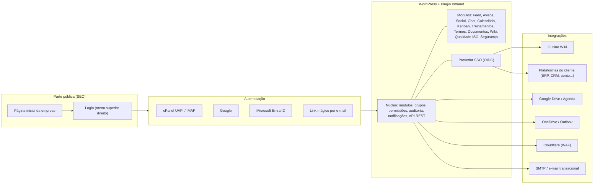
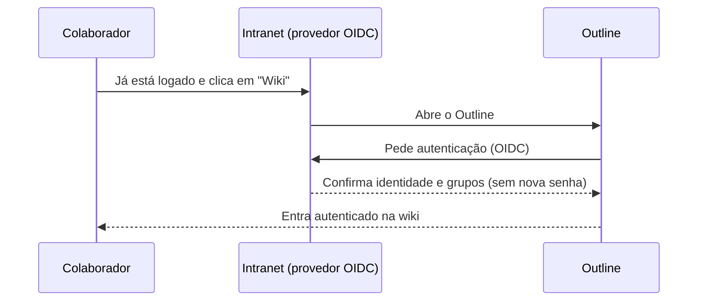

# Planejamento — Plugin de Intranet Corporativa para WordPress

> **Codinome provisório:** *Intranet Midnal* (nome comercial a definir — ver [§17](#17-decisões-pendentes-preciso-da-sua-resposta)).
> **Status:** proposta para aprovação · **Versão:** 0.1 · **Data:** 03/10/2026
> **Objetivo deste documento:** consolidar o escopo, a arquitetura e as ideias novas antes de qualquer código. Marque em cada item o que aprova, ajusta ou descarta.

---

## Sumário

1. [Resposta curta: é possível?](#1-resposta-curta-é-possível)
2. [Visão do produto](#2-visão-do-produto)
3. [Arquitetura técnica](#3-arquitetura-técnica)
4. [Como habilitar para os clientes (modelo de implantação)](#4-como-habilitar-para-os-clientes-modelo-de-implantação)
5. [Identidade, login e acesso](#5-identidade-login-e-acesso)
6. [Estrutura organizacional, grupos e permissões](#6-estrutura-organizacional-grupos-e-permissões)
7. [Catálogo de módulos](#7-catálogo-de-módulos)
8. [Templates visuais (mínimo 8) e personalização](#8-templates-visuais-mínimo-8-e-personalização)
9. [Página inicial pública, login e SEO](#9-página-inicial-pública-login-e-seo)
10. [Wiki: Outline integrado × módulo próprio](#10-wiki-outline-integrado--módulo-próprio)
11. [Área de downloads restrita — critérios de segurança](#11-área-de-downloads-restrita--critérios-de-segurança)
12. [Painel de segurança do ambiente](#12-painel-de-segurança-do-ambiente)
13. [LGPD, logs e evidências](#13-lgpd-logs-e-evidências)
14. [O que as intranets de mercado têm (e o que absorvemos)](#14-o-que-as-intranets-de-mercado-têm-e-o-que-absorvemos)
15. [Requisitos não funcionais](#15-requisitos-não-funcionais)
16. [Roadmap em fases](#16-roadmap-em-fases)
17. [Decisões pendentes (preciso da sua resposta)](#17-decisões-pendentes-preciso-da-sua-resposta)
18. [Ideias novas para aprovação](#18-ideias-novas-para-aprovação)
19. [Próximos passos](#19-próximos-passos)
- [Anexo A — Estrutura do plugin](#anexo-a--estrutura-do-plugin)
- [Anexo B — Modelo de dados (resumo)](#anexo-b--modelo-de-dados-resumo)
- [Anexo C — Mapeamento normativo](#anexo-c--mapeamento-normativo)

---

## 1. Resposta curta: é possível?

**Sim.** Tudo o que você descreveu é viável como um plugin WordPress modular, com funcionalidades ativáveis, templates selecionáveis e uma área administrativa própria. É um produto de porte comparável a plataformas comerciais de intranet, então o caminho realista é **entregar em fases**, cada uma utilizável.

Há quatro pontos que mudam o desenho e precisam ficar claros desde já:

| # | Ponto | Impacto | Como resolvemos |
|---|---|---|---|
| 1 | **Roundcube não tem API de login.** | Não dá para "logar pelo Roundcube". | Validamos o e-mail/senha da conta cPanel pela **API UAPI do cPanel** (`Email::verify_password`) ou por **IMAP** no servidor de e-mail. Para o usuário, o efeito é o mesmo: entra com o e-mail e a senha do webmail. |
| 2 | **Chat em tempo real em hospedagem compartilhada (cPanel)** normalmente não suporta WebSocket. | Chat "instantâneo" depende da hospedagem. | Chat com **adaptador**: em cPanel funciona por *polling* inteligente (atualização a cada poucos segundos); em VPS ou com serviço externo, liga o tempo real (WebSocket). |
| 3 | **Outline exige servidor próprio (normalmente Docker, com PostgreSQL e Redis)** e tem licença **BSL 1.1**, que proíbe oferecê-lo como serviço comercial de documentos a terceiros sem licença comercial. | Hospedar Outline pela Midnal para vários clientes tem risco de licença. | Recomendação: **módulo Wiki próprio** (inspirado no Outline) como padrão + **conector Outline opcional** com SSO real (OIDC), sem depender de *magic link*. Detalhes em [§10](#10-wiki-outline-integrado--módulo-próprio). |
| 4 | **"Log de tudo" gera dados pessoais** (IP, horários, comportamento). | Obrigações de LGPD para o cliente (controlador) e para a Midnal (operador). | Logs com finalidade definida, retenção configurável, aviso de privacidade ao colaborador e trilha imutável. Ver [§13](#13-lgpd-logs-e-evidências). |

---

## 2. Visão do produto

**Uma intranet de gestão corporativa com foco em Qualidade, Compliance e normas ISO**, que une comunicação interna, rede social corporativa, treinamentos obrigatórios com evidência, gestão documental, tarefas e segurança, em um único ambiente responsivo, com a identidade visual de cada cliente.

**Diferencial frente a intranets genéricas:** cada ação relevante gera **evidência auditável** (aceites, leituras, treinamentos, provas, certificados, downloads, versões), pronta para auditoria de certificação ISO, auditoria interna e defesa jurídica/trabalhista.

**Públicos:**

| Público | O que precisa |
|---|---|
| Colaborador | Ver o que é dele: pendências, avisos, treinamentos, tarefas, documentos, chat, pessoas. Simples, no celular. |
| Gestor de área | Publicar para sua área, acompanhar a equipe (treinamentos, aceites, tarefas), gerir o Kanban. |
| Qualidade / Compliance / RH | Controlar documentos, termos, treinamentos, competências, não conformidades; extrair relatórios e evidências. |
| Administrador do cliente | Configurar marca, módulos, grupos, usuários, integrações, segurança, sem tocar no `wp-admin`. |
| Auditor (interno/externo) | Acesso somente leitura e temporário às evidências selecionadas. |
| Midnal (superadministrador) | Implantar, licenciar, atualizar, dar suporte a vários clientes. |

---

## 3. Arquitetura técnica

### 3.1 Princípios

1. **Um plugin núcleo + módulos ativáveis.** Cada funcionalidade (Feed, Chat, Treinamentos, Kanban…) é um módulo com chave liga/desliga, dependências declaradas e permissões próprias. Módulo desligado não carrega código nem aparece no menu.
2. **Independente do tema.** A área logada (`/intranet`) é renderizada pelo próprio plugin, com seus templates. Funciona com qualquer tema e não quebra quando o cliente troca o tema do site. A parte pública usa o editor de blocos (Gutenberg) com blocos e padrões próprios.
3. **Dados de alto volume em tabelas próprias** (logs, mensagens de chat, progresso de aulas, aceites, downloads). Conteúdo editorial em *Custom Post Types* (aproveita revisões, editor e busca do WordPress).
4. **API REST única** (`/wp-json/intranet/v1/...`) consumida pelo front-end, pelo app (PWA) e por integrações externas.
5. **Trabalho pesado em segundo plano** (e-mails, relatórios, sincronizações, varreduras de segurança) via fila (*Action Scheduler*) e cron real do cPanel, nunca no clique do usuário.
6. **Segurança por padrão:** toda rota verifica permissão; todo segredo (tokens de API, chaves) é criptografado com chave fora do banco.

### 3.2 Stack proposta

| Camada | Tecnologia | Por quê |
|---|---|---|
| Servidor | PHP 8.2+ (recomendado 8.3), WordPress 6.6+, MySQL 8 / MariaDB 10.6+ | Compatível com cPanel atual. |
| Área logada | SPA em React + TypeScript (`@wordpress/scripts`), PWA instalável | Experiência de aplicativo, rápida no celular, offline parcial. |
| Parte pública | PHP renderizado no servidor + blocos Gutenberg próprios | SEO e desempenho (HTML pronto para o Google). |
| Administração do cliente | "Central de Administração" no front-end (React), fora do `wp-admin` | Usabilidade; o `wp-admin` fica restrito à Midnal. |
| Fila / agendamentos | Action Scheduler + cron real do cPanel (`wp cron event run` ou `wp-cron.php`) | Confiabilidade de e-mails, lembretes e varreduras. |
| PDFs (certificados, comprovantes) | mPDF ou Dompdf + QR Code | Certificados e comprovantes de aceite com código de verificação. |
| Tempo real (opcional) | Adaptador: *polling* (padrão) · Pusher/Ably · Soketi/Centrifugo (VPS) | Chat e notificações instantâneas onde a hospedagem permitir. |
| Busca | MySQL FULLTEXT (padrão) · Meilisearch (opcional, VPS) | Busca global com permissões. |
| Cache | Object cache (Redis/Memcached) quando disponível; LiteSpeed Cache na parte pública | Área logada não pode usar cache de página. |

### 3.3 Visão geral



### 3.4 Requisitos de hospedagem

| Recurso | Mínimo (cPanel compartilhado de boa qualidade) | Recomendado (VPS, com ou sem cPanel) |
|---|---|---|
| Usuários | até ~150–200 ativos simultâneos | centenas a milhares |
| PHP | 8.2, `memory_limit` 256M, `max_execution_time` 60s | 8.3, 512M, OPcache |
| Banco | MySQL 8 / MariaDB 10.6 | idem + ajustes de *buffer* |
| Cron | cron real a cada 1–5 min | idem |
| Cache | — | Redis |
| Chat | *polling* | WebSocket (Soketi/Centrifugo) |
| Antivírus de upload | ClamAV se o provedor oferecer | ClamAV |
| Outline | não suportado | Docker + PostgreSQL + Redis + armazenamento (local ou S3) |
| SSL | obrigatório (AutoSSL/Let's Encrypt) | obrigatório |

> Observação técnica: a extensão `imap` saiu do núcleo do PHP 8.4. A autenticação IMAP será implementada com conexão TLS direta (sem depender da extensão), garantindo compatibilidade futura.

---

## 4. Como habilitar para os clientes (modelo de implantação)

### 4.1 Opções

| Modelo | Como funciona | Prós | Contras | Indicação |
|---|---|---|---|---|
| **A. Instância dedicada** | Um WordPress por cliente, em subdomínio (`intranet.cliente.com.br`), na hospedagem do cliente ou da Midnal. | Isolamento total (segurança e LGPD), personalização livre, usa o servidor de e-mail do próprio cliente. | Mais instâncias para atualizar (resolvido com painel central). | **Recomendado como padrão.** |
| B. WordPress Multisite | Uma rede, um site por cliente. | Gestão centralizada, 1 atualização para todos. | Banco e código compartilhados: falha em um afeta todos; mais difícil cumprir pedidos de isolamento/LGPD. | Clientes pequenos hospedados pela Midnal. |
| C. Híbrido | A + B conforme o porte. | Flexível. | Duas operações. | Médio prazo. |

**Sugestão:** a intranet sempre em **subdomínio separado do site institucional** do cliente. Isola riscos (um plugin vulnerável no site não expõe a intranet) e mantém o SEO do site principal intacto.

### 4.2 Processo de implantação (padronizado)

1. **Provisionamento** — script WP-CLI cria a instalação, instala o plugin, aplica *hardening*, configura SSL, cron real e SMTP.
2. **Assistente de configuração (wizard)** no primeiro acesso:
   1. Dados da empresa (razão social, CNPJ, endereço, contatos, redes, logos).
   2. Escolha do template e das cores (pré-visualização ao vivo).
   3. Módulos contratados (liga/desliga conforme o plano).
   4. Métodos de login (cPanel/IMAP, Google, Microsoft, link mágico, login próprio) e domínios de e-mail permitidos.
   5. Estrutura: unidades, áreas/grupos, cargos.
   6. Importação de usuários (lista de contas do cPanel, CSV, Google Workspace ou Microsoft 365).
   7. Políticas e termos iniciais (modelos prontos editáveis: Compliance/Anticorrupção, LGPD, Uso de IA, Segurança da Informação, Termos de Uso).
   8. Revisão e publicação.
3. **Carga de conteúdo** — documentos, treinamentos, links.
4. **Treinamento** dos administradores e comunicação de lançamento aos colaboradores (kit pronto: e-mail, cartaz com QR Code, tutorial em vídeo).
5. **Operação** — atualizações, monitoramento, suporte.

### 4.3 Licenciamento e atualizações

- Chave de licença por cliente, validada em um **servidor de licenças/atualizações da Midnal**: libera módulos do plano e entrega atualizações automáticas pelo painel do WordPress.
- **Painel central Midnal** (fase posterior): lista de clientes, versão instalada, saúde, alertas de segurança, vencimento de licença.
- Observação: plugins WordPress distribuídos seguem a licença GPL. O valor comercial está em **atualizações, suporte, implantação, hospedagem e serviços** — modelo usual do mercado.

### 4.4 Sugestão de planos (para validar)

| Plano | Módulos |
|---|---|
| **Essencial — Comunicação** | Página pública + login, home personalizável, feed, avisos com e-mail, calendário, links, diretório de pessoas, termos com aceite, área do usuário, downloads restritos, 4 templates. |
| **Profissional — Colaboração** | Essencial + treinamentos (provas e certificados), tarefas/Kanban, chat, área social, grupos/páginas por área, Google Drive/Microsoft 365, wiki, todos os templates. |
| **Gestão ISO — Enterprise** | Profissional + controle de documentos ISO, qualidade (NC/CAPA, auditorias, indicadores, riscos), matriz de competências, canal de denúncias, painel de segurança avançado, SSO para outras plataformas, Outline, portal do auditor, *white-label*. |

Serviços avulsos: implantação, migração de dados, identidade visual, conteúdo de treinamentos, suporte com SLA.

---

## 5. Identidade, login e acesso

### 5.1 Métodos de login (todos configuráveis, combináveis)

| Método | Como funciona | Quando usar | Observações |
|---|---|---|---|
| **E-mail corporativo cPanel — via UAPI** | O plugin chama `Email::verify_password` na API do cPanel com um *token* da conta. | Cliente hospeda e-mail no cPanel e fornece *token*. | Também permite **sincronizar a lista de contas** (`Email::list_pops`): quem tem e-mail ganha acesso; conta excluída no cPanel é bloqueada na intranet. O *token* de API do cPanel dá acesso amplo à conta: armazenamos criptografado, com data de expiração e rotação. |
| **E-mail corporativo cPanel — via IMAP** | O plugin tenta autenticar no servidor IMAP (porta 993, TLS) com o e-mail e a senha digitados. | Quando não há *token* do cPanel, ou como alternativa mais restrita. | Não exige credencial privilegiada. A senha nunca é armazenada. Atenção ao *cPHulk*/*fail2ban*: tentativas erradas podem bloquear o IP do servidor da intranet, por isso o plugin limita tentativas antes de consultar o servidor. |
| **Google** (OAuth 2.0 / OIDC) | Botão "Entrar com Google". | Clientes com Google Workspace. | Restringe por domínio (`hd`). Só funciona se o e-mail for uma Conta Google. |
| **Microsoft** (Entra ID / OIDC) | Botão "Entrar com Microsoft". | Clientes com Microsoft 365. | Restringe por *tenant*. |
| **Link mágico por e-mail** | Usuário digita o e-mail e recebe um link de uso único (validade de 10–15 min). | Universal; prova que a pessoa tem acesso à caixa de e-mail corporativa (inclusive Roundcube). | Ótimo complemento ao cPanel: dispensa senha. |
| **Login próprio** | Usuário e senha da intranet, com política de senha forte. | Terceiros, consultores, quem não tem e-mail corporativo. | — |
| **Matrícula + PIN / QR Code** *(ideia nova)* | Para equipes operacionais sem e-mail; ideal em totens/quiosques. | Indústria, varejo, logística. | Sessão curta e logout automático em dispositivo compartilhado. |

**Sobre o Roundcube:** ele é apenas a interface do webmail. A intranet oferece um atalho "Webmail" (ex.: `https://webmail.cliente.com.br` ou porta 2096). *Login automático* no Roundcube exigiria guardar a senha do e-mail do usuário, o que **não recomendamos** por segurança.

### 5.2 Segurança do acesso

- **2FA**: TOTP (Google Authenticator, Authy etc.) e **passkeys/WebAuthn** (biometria do celular). Obrigatoriedade configurável por papel (ex.: obrigatório para administradores e para quem acessa documentos confidenciais).
- **Vinculação de contas**: o mesmo usuário pode entrar por Google, Microsoft ou cPanel; o vínculo é pelo e-mail verificado.
- **Provisionamento**:
  - *Pré-cadastro* (somente quem foi importado/convidado entra), ou
  - *Criação automática no primeiro login* (JIT), restrita aos domínios permitidos, com opção de aprovação pelo administrador.
- **Desligamento (offboarding)**: bloqueio imediato, encerramento de todas as sessões, transferência de tarefas e grupos, **preservação dos registros** (aceites, treinamentos, logs) conforme a política de retenção.
- **Sessões**: tempo de inatividade configurável, lista de dispositivos ativos, "sair de todos os dispositivos".
- **Proteções**: limite de tentativas por IP e por conta, bloqueio progressivo, CAPTCHA invisível (Cloudflare Turnstile), alerta de login de novo dispositivo/país.

### 5.3 A intranet como "porta única" (SSO para outras plataformas) *(ideia nova)*

O plugin pode atuar como **provedor de identidade OpenID Connect (OIDC)**. Assim, plataformas compatíveis (Outline, Nextcloud, Moodle, Grafana, Metabase, alguns ERPs/CRMs) aceitam o login da intranet: o usuário clica no link e **já entra autenticado**, sem nova senha nem *magic link*. Ao desligar alguém na intranet, o acesso às plataformas conectadas também cai.

---

## 6. Estrutura organizacional, grupos e permissões

### 6.1 Entidades

- **Empresa** → **Unidades/Filiais** → **Áreas/Grupos** (Operações, Jurídico, Administrativo, Qualidade, RH, TI, Comercial…) → **Cargos**.
- **Grupos** podem ser:
  - *Departamentais* (oficiais, geridos pelo administrador);
  - *Projetos/comitês* (temporários, com data de encerramento);
  - *Comunidades* (interesse, opcionais);
  - *Dinâmicos* *(ideia nova)*: membros definidos por regra (ex.: "cargo = Técnico **e** unidade = Fábrica 2"), atualizados automaticamente.
- **Visibilidade do grupo:** aberto (todos veem), privado (só membros veem o conteúdo), secreto (nem aparece para não membros).
- **Entrada no grupo:** livre, por solicitação, por convite ou automática por regra.

### 6.2 Papéis globais (sugestão)

| Papel | Resumo |
|---|---|
| Superadministrador (Midnal) | Tudo, inclusive licença, `wp-admin`, integrações técnicas. |
| Administrador da intranet (cliente) | Marca, templates, módulos, usuários, grupos, integrações, segurança. |
| Gestor de Comunicação | Feed, avisos, home, calendário, banners. |
| Gestor da Qualidade/Compliance | Documentos, termos, treinamentos, competências, NC/CAPA, auditorias, relatórios. |
| Gestor de RH | Usuários, cargos, qualificações, treinamentos, onboarding/offboarding. |
| Gestor de Área | Administra o(s) seu(s) grupo(s): publicações, membros, Kanban, documentos da área. |
| Colaborador | Uso padrão. |
| Auditor | **Somente leitura**, com prazo de validade, sobre evidências selecionadas. |
| Convidado/Externo | Terceiros e fornecedores, acesso restrito a grupos específicos e com expiração. |

### 6.3 Permissões granulares

Matriz configurável **módulo × ação × papel/grupo** (ver, criar, editar, publicar, aprovar, moderar, excluir, exportar, administrar). Exemplo:

| Ação | Colaborador | Gestor de Área | Gestor Qualidade | Auditor | Admin |
|---|:-:|:-:|:-:|:-:|:-:|
| Ler documentos da sua área | ✅ | ✅ | ✅ | ✅* | ✅ |
| Publicar no feed da área | ⚙️ | ✅ | ✅ | ❌ | ✅ |
| Aprovar documento ISO | ❌ | ⚙️ | ✅ | ❌ | ✅ |
| Ver relatório de aceites | ❌ | da equipe | ✅ | ✅* | ✅ |
| Exportar evidências | ❌ | ❌ | ✅ | ✅* | ✅ |
| Configurar template | ❌ | ❌ | ❌ | ❌ | ✅ |

✅ permitido · ❌ negado · ⚙️ configurável · \* somente no escopo e no período liberados ao auditor.

**Páginas por grupo:** cada grupo tem sua **página/mini-site** (capa, apresentação, membros e gestores, feed próprio, documentos, wiki, Kanban, calendário, links, canal de chat), com cor de destaque própria dentro da identidade da empresa.

---

## 7. Catálogo de módulos

Legenda de fase: **F1** = MVP · **F2** · **F3** · **F4** (ver [§16](#16-roadmap-em-fases)). Itens marcados *(novo)* são sugestões além do que você pediu.

### 7.1 Home da intranet (painel personalizável) — F1

- Montada com **widgets**: pendências (termos, treinamentos, leituras, tarefas), avisos, feed, agenda, aniversariantes e tempo de casa, links rápidos, indicadores, boas-vindas a novos colaboradores, enquete, clima/tempo, cotações, banner rotativo.
- **Layouts por público**: o administrador define a home padrão por grupo/unidade/cargo (ex.: home da Fábrica ≠ home do Jurídico).
- O colaborador pode reorganizar e ocultar widgets, se o administrador permitir.
- **Barra "Minhas pendências"** sempre visível: o que falta aceitar, ler, estudar e entregar.

### 7.2 Feed de notícias e comunicados — F1

- Publicações com texto, imagens, galerias, vídeos, anexos, enquetes.
- Segmentação por grupo/unidade/cargo; agendamento e expiração; destaque fixo.
- Reações, comentários (moderáveis), @menções, #tags.
- Fluxo editorial opcional (rascunho → revisão → publicado).
- Estatísticas: alcance, leituras, reações.

### 7.3 Avisos e alertas — F1

- Níveis: **Informativo**, **Importante**, **Crítico**.
- Canais: faixa no topo, *pop-up* com confirmação obrigatória, e-mail com identidade da empresa, notificação *push* (PWA), WhatsApp/SMS opcional *(novo)*.
- **"Li e estou ciente"** com registro (quem, quando, IP, versão do aviso) e relatório de quem leu e quem não leu, com **reenvio automático** para pendentes.
- Agendamento, expiração e segmentação.

### 7.4 E-mails com identidade da empresa — F1

- Modelos HTML responsivos com logo, cores, rodapé (razão social, CNPJ, endereço, contatos) e assinatura do remetente.
- Envio pelo SMTP do cPanel do cliente (ex.: `intranet@cliente.com.br`) ou serviço transacional (Amazon SES, Brevo, Postmark).
- **Fila com limite de envio por hora** (o cPanel limita envios por domínio) e reprocessamento automático em caso de falha.
- Verificação de **SPF, DKIM e DMARC** (exibida no painel de segurança) para não cair em spam.
- Resumo diário/semanal (*digest*) configurável pelo usuário para conteúdos não obrigatórios.

### 7.5 Área social — F2

- Perfis com foto, cargo, área, gestor, ramal, habilidades, bio.
- **Diretório de pessoas** e **organograma automático** (a partir do campo "gestor").
- Aniversariantes, tempo de casa, boas-vindas a novos colaboradores.
- **Reconhecimentos/elogios** vinculados aos valores da empresa *(novo)*; selos.
- Comunidades de interesse, galerias de fotos, classificados internos/caronas.
- Gamificação opcional (pontos por treinamentos e participação), desligada por padrão.
- Moderação: denúncia de publicações, filtro de palavras, histórico.

### 7.6 Chat entre usuários — F2

- Conversas 1:1, grupos e **canais por área** (criados junto com o grupo).
- Anexos, emojis, @menções, respostas em linha, indicadores de leitura e presença.
- Notificações no navegador, PWA e e-mail (mensagens não lidas).
- **Conformidade**: retenção configurável, mensagens editadas/excluídas preservadas na trilha de auditoria, exportação para fins legais por perfil autorizado, aviso claro aos usuários sobre a política.
- Tempo real via adaptador (ver [§3.2](#32-stack-proposta)).

### 7.7 Calendário e reservas — F1 (calendário) / F2 (reservas)

- Agendas global, por grupo e pessoal; eventos recorrentes; confirmação de presença (RSVP); lembretes.
- Camadas automáticas: treinamentos, auditorias, vencimentos de documentos e certificados, feriados nacionais/locais, aniversários.
- Exportação/assinatura ICS e sincronização com Google Agenda e Outlook.
- **Reserva de salas, veículos e equipamentos** com aprovação e regras *(novo)*.

### 7.8 Tarefas e Kanbans — F2

- **Quadros globais, por área/grupo e pessoais**, com colunas configuráveis e limite de WIP.
- Cartões: responsável(is), observadores, prazo, prioridade, etiquetas, *checklist*, anexos, comentários com @menção, recorrência; dependências (F3).
- **Dois tipos de tarefa atribuída a grupo:**
  - *Compartilhada* — qualquer membro conclui por todos.
  - *Individual em massa* — cada membro precisa concluir a sua (ex.: "atualize seu cadastro"), com painel de acompanhamento.
- Visões: Kanban, lista, calendário e **"Minhas tarefas"** (consolida tudo de todos os quadros).
- Automações simples: ao mover para "Concluído", notificar; prazo vencido, alertar gestor.
- **Modelos de quadro**: Plano de ação 5W2H, PDCA, Onboarding de colaborador, Preparação para auditoria.
- Tarefas geradas automaticamente por outros módulos (treinamento atrasado, documento a revisar, ação corretiva).

### 7.9 Treinamentos obrigatórios (LMS) — F2

- **Estrutura**: cursos → módulos → aulas (vídeo YouTube/Vimeo/Panda/Bunny, PDF, texto, link, arquivo) → avaliações. **Trilhas** (ex.: Integração de novos colaboradores, Compliance anual).
- **Atribuição** por grupo, unidade, cargo ou pessoa, com prazo, e **reciclagem periódica** (ex.: anual) automática.
- **Aceite de termos antes de iniciar** (ex.: termo de confidencialidade do conteúdo).
- **Logs das aulas**: início, fim, tempo assistido, percentual do vídeo (APIs dos *players*), opção de impedir avanço do vídeo, tentativas.
- **Provas**: banco de questões, sorteio, embaralhamento, tipos (múltipla escolha, V/F, associação, dissertativa com correção manual), nota mínima, número de tentativas, tempo limite.
- **Certificados** em PDF com modelo editável (logo, assinatura, carga horária, instrutor, validade) e **código + QR Code de verificação** em página pública.
- **Treinamentos presenciais** com lista de presença por QR Code/assinatura na tela *(novo)* — o registro de treinamento presencial também é evidência ISO.
- **Avaliação de eficácia** pelo gestor após X dias *(novo)* — atende ISO 9001 7.2 (c).
- Importação SCORM 1.2 / xAPI (F3).
- Relatórios por pessoa, área, curso e período; exportação Excel/PDF; alertas de atraso ao colaborador e ao gestor.

### 7.10 Políticas e termos com aceite (Compliance) — F1

- Modelos iniciais editáveis: **Código de Conduta, Compliance/Anticorrupção, LGPD e Proteção de Dados, Uso de IA, Segurança da Informação, Termos de Uso**, Confidencialidade, Uso de recursos de TI, Política de Assédio.
- **Versionamento**: cada versão tem hash (SHA-256) do conteúdo; nova versão relevante exige **novo aceite**.
- **Bloqueio de acesso** opcional até o aceite (*gate*).
- **Registro do aceite**: usuário, versão, hash, data/hora do servidor, IP, navegador/dispositivo, método de autenticação; opcional **confirmação por código (OTP) por e-mail** para reforçar a autoria *(novo)*.
- Comprovante em PDF para o colaborador e para a empresa.
- Painel: % de aceite por política, área e unidade; cobrança automática de pendentes.
- Recusa registrada com justificativa e encaminhamento ao responsável.

> A validade jurídica de aceites eletrônicos entre particulares tem base no art. 10, §2º, da MP 2.200-2/2001. Recomendamos que o jurídico do cliente valide o texto dos termos e o método de aceite.

### 7.11 Área do usuário — F1

- **Meu perfil**, **Minhas pendências**, **Meus termos** (histórico e comprovantes), **Meus treinamentos e certificados**, **Minhas tarefas**.
- **Minhas qualificações**: formação, cursos externos, certificações, registros profissionais (CREA, OAB, CRC…), NRs, idiomas, com anexos e **data de validade** → alerta automático de vencimento.
- Status de validação pelo RH/Qualidade (pendente, validado, recusado).
- **Privacidade (LGPD)**: ver e exportar meus dados, preferências de notificação.
- **Segurança**: 2FA, *passkeys*, sessões e dispositivos ativos.

**Consulta pelo administrador:** busca por qualificação ("quem tem NR-35 válida na unidade X?"), relatório de vencimentos, exportação.

**Matriz de competências** *(novo, F3)*: requisitos por cargo × qualificações e treinamentos do colaborador → **gaps** destacados e sugestão de treinamentos.

### 7.12 Gestão documental e Controle de Informação Documentada (ISO) — F1 (básico) / F3 (completo)

- **Bibliotecas** por grupo, com pastas, metadados (código, tipo, processo, norma, responsável, classificação), versões e *check-out/check-in*.
- **Fluxo de aprovação** (elaborador → revisor → aprovador) com assinatura eletrônica e registro.
- **Lista mestra** automática; código e revisão no cabeçalho/rodapé; **cópia controlada × não controlada** (marca d'água).
- **Leitura obrigatória com confirmação** quando o documento é publicado ou revisado *(novo)*.
- Revisão periódica com alerta; documentos obsoletos retidos e marcados.
- Visualização no navegador (PDF.js), busca no conteúdo dos PDFs.
- Área de downloads restrita: ver critérios em [§11](#11-área-de-downloads-restrita--critérios-de-segurança).

### 7.13 Wiki / Base de conhecimento — F2

Ver análise completa em [§10](#10-wiki-outline-integrado--módulo-próprio).

### 7.14 Hub de links e plataformas do cliente — F1

- Cartões com ícone para ERP, CRM, ponto eletrônico, webmail, sistemas de RH, BI etc.
- Visibilidade por grupo; favoritos do usuário; contagem de cliques.
- **SSO** quando a plataforma aceitar OIDC ([§5.3](#53-a-intranet-como-porta-única-sso-para-outras-plataformas-ideia-nova)).
- **Status das plataformas** (verifica se o sistema está no ar) *(novo, F3)*.

### 7.15 Busca global — F2

- Uma busca para pessoas, publicações, avisos, documentos (inclusive texto dentro de PDFs), wiki, cursos, links e tarefas — **sempre respeitando permissões**.
- Filtros, sugestões, "buscas sem resultado" para o administrador melhorar o conteúdo.
- Inclusão dos resultados do Outline (quando conectado) e do Google Drive.

### 7.16 Módulos de Qualidade / SGQ *(novo)* — F3

| Submódulo | O que faz | Norma |
|---|---|---|
| Não conformidades e ações corretivas (RNC/CAPA) | Registro, análise de causa (5 Porquês, Ishikawa), plano de ação (gera tarefas no Kanban), verificação de eficácia. | ISO 9001 10.2 |
| Auditorias internas | Programa anual, plano, *checklist* por requisito, constatações, relatório, ações. | ISO 9001 9.2 |
| Indicadores (KPIs) | Metas, lançamentos periódicos, gráficos, alertas de desvio. | ISO 9001 9.1 |
| Riscos e oportunidades | Matriz probabilidade × impacto, tratamento, monitoramento. | ISO 9001 6.1 / ISO 31000 |
| Requisitos legais | Registro de legislação aplicável, avaliação de atendimento. | ISO 14001 / 45001 |
| Fornecedores | Cadastro, qualificação, avaliação periódica. | ISO 9001 8.4 |
| Análise crítica pela direção | Pauta com entradas da norma preenchidas automaticamente pelos módulos, ata, decisões. | ISO 9001 9.3 |

Suporte a **Sistema de Gestão Integrado** (várias normas ao mesmo tempo), com o mapeamento de cláusulas configurável para acompanhar novas edições das normas.

### 7.17 Canal de denúncias e ouvidoria *(novo)* — F2

- Formulário **anônimo** (sem login, acessível também pela página pública), protocolo para acompanhamento, triagem por comitê, prazos, relatórios.
- Atende a exigência de canal para denúncias de assédio para empresas com CIPA (Lei 14.457/2022) e compõe o programa de integridade (Lei 12.846/2013 e Decreto 11.129/2022).
- Dados segregados, acesso só para o comitê, criptografia.

### 7.18 Formulários e solicitações (service desk interno) *(novo)* — F3

- Construtor de formulários; catálogo de solicitações para TI, RH, Facilities, Compras.
- Fluxos de aprovação, SLA, status para o solicitante.
- Exemplo ISO 27001: **solicitação e revisão de acesso a sistemas** com registro.

### 7.19 Pesquisas e engajamento *(novo)* — F2

- Enquetes rápidas, **pesquisas de clima / eNPS** anônimas, caixa de ideias com votação (inovação).

### 7.20 Onboarding e offboarding *(novo)* — F2

- Ao cadastrar um colaborador: trilha de integração, termos a aceitar, *checklist* para o gestor, apresentação no feed.
- Ao desligar: *checklist* de devolução de equipamentos e revogação de acessos, com registro.

### 7.21 Integrações — F2/F3

| Integração | O que faz | Observações |
|---|---|---|
| **Google Drive** | Anexar arquivos do Drive (Google Picker); vincular uma pasta/Drive compartilhado à página de um grupo; pré-visualizar. | Usa o escopo `drive.file` sempre que possível, que não exige a avaliação de segurança dos escopos restritos. Cada cliente usa seu próprio projeto no Google Cloud (ou o app verificado da Midnal). |
| Google Agenda | Sincroniza eventos. | — |
| **Microsoft 365** | OneDrive/SharePoint e Outlook via Microsoft Graph. | — |
| Nextcloud / WebDAV | Alternativa de nuvem própria. | Bom para quem não usa Google nem Microsoft. |
| **Outline** | SSO, sincronização de grupos, busca. | Ver [§10](#10-wiki-outline-integrado--módulo-próprio). |
| Cloudflare | WAF, eventos de *firewall* no painel de segurança. | Recomendado à frente da intranet. |
| Webhooks + API REST | Integração com n8n, Make, Zapier, sistemas de RH/ERP. | Tokens com escopo e expiração. |
| Teams / Slack | Replicar avisos em canais. | — |
| WhatsApp Business / SMS | Alertas críticos. | Custo por mensagem; *opt-in*. |
| Assinatura eletrônica (Clicksign, D4Sign, DocuSign) | Para documentos que exigem assinatura com maior força probatória. | Opcional. |
| OnlyOffice / Collabora | Edição de documentos Office no navegador. | F4, requer servidor. |

### 7.22 Central de notificações — F1

- Sino com contador; preferências por tipo e canal; obrigatórios não podem ser desligados.
- **Push no celular** via PWA (Android e iOS 16.4+ com o app adicionado à tela inicial).

### 7.23 Relatórios e analytics — F2

- Engajamento (usuários ativos diários/mensais), alcance de avisos, taxa de leitura, conteúdos mais vistos, conclusão de treinamentos, **% de conformidade** (termos aceitos, leituras obrigatórias), pesquisas sem resultado.
- **Relatório mensal automático para a diretoria** (PDF por e-mail) *(novo)*.

### 7.24 Portal do Auditor *(novo)* — F3

- Acesso temporário (com data de expiração) para auditor interno ou da certificadora, **somente leitura**, a um pacote de evidências selecionado (documentos vigentes, registros de treinamento, aceites, auditorias, NC/CAPA, indicadores). Tudo registrado.

### 7.25 Assistente de IA *(novo, opcional)* — F4

- Perguntas e respostas sobre documentos e wiki **com citação da fonte e respeitando permissões**; resumo de avisos longos; geração de questões de prova a partir do material do curso; rascunho de comunicados.
- Governado pela própria **Política de Uso de IA** do cliente: ativação explícita, fornecedor com contrato de processamento de dados e sem uso dos dados para treinamento de modelos, registro de uso.

### 7.26 Trilha de auditoria (log geral) — F1

Detalhada em [§13](#13-lgpd-logs-e-evidências).

---

## 8. Templates visuais (mínimo 8) e personalização

### 8.1 Presets propostos (10)

| # | Nome | Disposição | Indicado para |
|---|---|---|---|
| 1 | **Corporativo** | Menu superior, banner rotativo, 3 colunas de widgets. | Empresas tradicionais. |
| 2 | **Painel (App)** | Menu lateral recolhível, cartões de produtividade. | Escritórios, equipes administrativas. |
| 3 | **Social** | Feed central estilo rede social, atalhos e aniversariantes nas laterais. | Empresas com foco em engajamento. |
| 4 | **Revista** | Destaque editorial grande, grade de notícias por editoria. | Comunicação interna forte. |
| 5 | **Hub de Serviços** | Grade de blocos (*tiles*) com sistemas, formulários e links. | Autosserviço, muitos sistemas. |
| 6 | **Qualidade & Compliance** | Pendências, indicadores, documentos e auditorias em destaque. | Empresas certificadas ISO. |
| 7 | **Operacional / Chão de Fábrica** | Alto contraste, botões grandes, pouco texto, **modo quiosque**. | Indústria, logística, varejo. |
| 8 | **Minimalista** | Muito espaço em branco, tipografia forte. | Startups, consultorias. |
| 9 | **Institucional Clássico** | Sóbrio, serifado, cores neutras. | Escritórios de advocacia e contabilidade. |
| 10 | **Escuro / Tech** | Modo escuro nativo, contrastes vivos. | Tecnologia. |

### 8.2 O que é personalizável em cada um

- **Marca**: logos (versão clara e escura), favicon, imagem de fundo do login, nome e *slogan*.
- **Cores**: primária, secundária, destaque, fundo, texto, sucesso/alerta/erro, com **verificador automático de contraste (WCAG AA)**.
- **Tipografia**: famílias (Google Fonts ou fontes do sistema), tamanhos-base.
- **Formas e densidade**: arredondamento dos cantos, sombras, espaçamento (compacto/normal/confortável).
- **Navegação**: menu superior ou lateral, itens e ordem, ícones.
- **Modo**: claro, escuro ou automático (segue o celular).
- **Widgets e disposição** da home, por público.
- **Cor de destaque por grupo/área**, mantendo a identidade.
- **Pré-visualização ao vivo** (desktop/tablet/celular), **exportar/importar tema** (JSON) e **duplicar preset** para criar variações próprias.

Tecnicamente, cada template é um conjunto de *design tokens* (variáveis CSS) + estrutura de layout, o que permite trocar de template sem perder conteúdo.

> **Dúvida:** você escreveu que os templates seriam selecionados/customizados "pelo auditor". No desenho atual, isso é função do **Administrador da intranet**; o papel **Auditor** é somente leitura. Confirma? (ver [§17](#17-decisões-pendentes-preciso-da-sua-resposta))

---

## 9. Página inicial pública, login e SEO

### 9.1 Página padrão (já vem pronta)

Estrutura sugerida, totalmente editável por blocos:

1. **Cabeçalho**: logo, menu e botão **"Entrar"** no canto superior direito, que abre o painel com os métodos habilitados (Google, Microsoft, e-mail corporativo/cPanel, link mágico, login próprio).
2. **Boas-vindas**: nome da empresa, *slogan*, chamada "Bem-vindo à intranet da [Empresa]".
3. **O que você encontra aqui**: cartões explicativos (comunicados, treinamentos, documentos, tarefas, chat, pessoas).
4. **Como acessar**: passo a passo com o método de login da empresa e o que fazer no primeiro acesso.
5. **Notícias públicas** (opcional).
6. **Canal de denúncias** (acesso anônimo) e **Aviso de privacidade**.
7. **Perguntas frequentes** (dúvidas de acesso, senha, suporte).
8. **Contato**: endereço, telefones, e-mail, WhatsApp, mapa, horário, redes sociais.
9. **Rodapé**: razão social, CNPJ, links institucionais, banner de cookies (LGPD).

### 9.2 SEO da parte pública

- HTML renderizado no servidor, *title* e *meta description* por página, Open Graph e cartões de redes sociais.
- Dados estruturados JSON-LD: `Organization`, `WebSite`, `ContactPoint`, `FAQPage`, `LocalBusiness` quando aplicável.
- *Sitemap* somente com páginas públicas; `robots.txt` bloqueando a área logada; cabeçalho `X-Robots-Tag: noindex` em **todas** as rotas privadas.
- Metas de *Core Web Vitals*: LCP < 2,5 s, INP < 200 ms, CLS < 0,1 (imagens WebP/AVIF, *lazy loading*, CSS crítico).
- Compatível com Yoast SEO e Rank Math, sem depender deles.
- URLs amigáveis, *canonical*, `hreflang` se multi-idioma.

---

## 10. Wiki: Outline integrado × módulo próprio

### 10.1 Opções

| | **A. Integrar Outline (SSO via OIDC)** | **B. Automatizar o *magic link* do Outline** | **C. Módulo Wiki próprio (inspirado no Outline)** |
|---|---|---|---|
| Como | A intranet vira provedor OIDC; o Outline é configurado com `OIDC_CLIENT_ID`, `OIDC_AUTH_URI`, `OIDC_TOKEN_URI`, `OIDC_USERINFO_URI`. O usuário clica em "Wiki" e entra direto. | Interceptar/gerar o link enviado por e-mail. | Wiki dentro do plugin, com os mesmos usuários, grupos, permissões e logs. |
| Experiência | Excelente (editor do Outline). | Frágil. | Muito boa; evolui com o produto. |
| Hospedagem | Requer VPS (normalmente Docker) com PostgreSQL, Redis e armazenamento local ou S3. | Idem. | Qualquer hospedagem (inclusive cPanel). |
| Usuários e grupos | Criados no primeiro login; grupos sincronizados pela API do Outline. | — | Nativos. |
| Controle de versões | Do Outline. | — | Revisões com comparação (*diff*) e restauração. |
| Logs e evidências ISO | Separados da intranet. | — | Unificados com a trilha de auditoria e o controle de documentos (aprovação, leitura obrigatória). |
| Licença | **BSL 1.1**: uso interno pela empresa é permitido; oferecer como serviço comercial a terceiros ("Document Service") é proibido sem licença comercial. | Idem. | Código próprio (sem copiar o Outline), com bibliotecas livres (TipTap/ProseMirror, Yjs). |
| Recomendação | ✅ **Conector opcional** para quem já usa Outline (ou quer o Outline em servidor próprio, em nome do cliente). | ❌ **Não recomendado** (inseguro e quebra com atualizações). | ✅ **Padrão do produto.** |

> Sobre a licença: o arquivo LICENSE do Outline define BSL 1.1 com *Additional Use Grant* que veda o uso como "Document Service" — oferta comercial que permite a terceiros (além dos seus funcionários e prestadores) criar equipes e documentos controlados por eles. Cada versão vira Apache 2.0 só na sua *Change Date* (a versão atual: 09/09/2030). Se a Midnal for hospedar Outline para clientes, é preciso licença comercial com a General Outline, Inc. ou que a instalação seja do próprio cliente. **Validar com o jurídico.**

### 10.2 Módulo Wiki próprio — funcionalidades

- **Coleções** (ex.: "Procedimentos Operacionais", "Jurídico", "TI") com permissão por grupo.
- Árvore de páginas com arrastar e soltar; *breadcrumbs*.
- Editor rico com Markdown, comando `/`, tabelas, *checklists*, blocos de código, imagens, vídeos, *embeds* (Google Drive, Figma, Miro…), menções a pessoas e páginas.
- **Histórico de versões** com comparação lado a lado e restauração; quem alterou o quê e quando.
- Modelos de página (POP, Instrução de Trabalho, FAQ, Ata).
- Comentários em trechos, *backlinks* ("páginas que citam esta"), favoritos, "visto recentemente".
- Publicação de página para leitura pública por link (opcional, com expiração).
- Exportação em Markdown/PDF; **importação de Markdown e do export do Outline** (facilita migração).
- **Ponte com o controle de documentos ISO**: uma página wiki pode virar documento controlado (código, aprovação, leitura obrigatória).
- Edição simultânea em tempo real: F4 (requer servidor de tempo real). Até lá, bloqueio de edição com aviso "fulano está editando".

### 10.3 Conector Outline — funcionalidades

- Provedor OIDC embutido na intranet (login único, sem *magic link*).
- Sincronização de grupos da intranet → grupos do Outline (permissões nas coleções).
- Busca do Outline dentro da busca global da intranet.
- Últimos documentos do Outline em um widget da home.



---

## 11. Área de downloads restrita — critérios de segurança

Critérios recomendados (todos implementáveis; os marcados ⭐ são essenciais desde o MVP):

| # | Critério | Por quê |
|---|---|---|
| 1 | ⭐ Arquivos **fora da pasta pública** (ou pasta com bloqueio total) e entregues pelo PHP após verificar permissão a cada requisição. | Impede acesso por link direto. |
| 2 | ⭐ **Links assinados e temporários** (5–15 min), vinculados ao usuário. | Link copiado/repassado expira. |
| 3 | ⭐ Permissão por grupo, papel e pessoa + **classificação da informação**: Público, Interno, Confidencial, Restrito. | ISO 27001 5.12/5.13. |
| 4 | ⭐ **Log completo** de visualizações e downloads (quem, quando, IP, dispositivo, versão). | Rastreabilidade e investigação. |
| 5 | ⭐ Lista de extensões permitidas, verificação do tipo real do arquivo, limite de tamanho. | Evita *upload* malicioso. |
| 6 | **2FA obrigatório** para Confidencial/Restrito e **reautenticação** para Restrito. | Reduz risco de conta comprometida. |
| 7 | **Marca d'água dinâmica** em PDFs (nome, e-mail, data/hora). | Desestimula vazamento e identifica a origem. |
| 8 | **Visualização somente online** (sem botão de download) para Restrito. | Dificulta a cópia. |
| 9 | **Alerta de download em massa** e limite por hora. | Detecta exfiltração (ISO 27001 8.12). |
| 10 | Antivírus no *upload* (ClamAV) e bloqueio opcional de arquivos com macros. | ISO 27001 8.7. |
| 11 | Hash SHA-256 de cada versão; versionamento; obsoletos marcados. | Integridade e controle documental. |
| 12 | **Criptografia em repouso** para Restrito (chave fora do banco). | Proteção em caso de vazamento do servidor/backup. |
| 13 | **Termo de confidencialidade** aceito antes de acessar pastas Restritas. | Integra com o módulo de termos. |
| 14 | **Acesso com prazo** para externos (fornecedores, auditores) e revisão periódica de acessos. | ISO 27001 5.18. |
| 15 | Cabeçalhos `no-store`, `noindex`, `X-Content-Type-Options`. | Evita cache e indexação. |
| 16 | Backups criptografados e testados. | ISO 27001 8.13. |

---

## 12. Painel de segurança do ambiente

### 12.1 Indicadores

| Bloco | Itens monitorados | Fonte |
|---|---|---|
| **Usuários e acessos** | Usuários sem uso há 30/60/90 dias (configurável), contas nunca usadas, sem 2FA, administradores, externos com acesso vencido, desligados ainda ativos, sessões ativas. | Plugin |
| **Login** | Tentativas falhas, bloqueios, IPs e países de origem, logins fora do horário, novos dispositivos. | Plugin (+ base GeoIP) |
| **Firewall de aplicação (WAF)** | Requisições bloqueadas, regras acionadas, IPs mais agressivos, bloqueios por país, taxa de requisições. | Firewall próprio (camada PHP) · **API Cloudflare** · tabelas do Wordfence se instalado · ModSecurity do servidor (só com acesso de revenda/root) |
| **SSL/TLS** | Validade do certificado (alerta 30/15/7 dias), emissor, cadeia, versão TLS, redirecionamento HTTPS, HSTS; status do AutoSSL. | Verificação direta + UAPI cPanel |
| **Cabeçalhos de segurança** | CSP, X-Frame-Options, Referrer-Policy, Permissions-Policy, X-Content-Type-Options. | Verificação direta |
| **Software** | Versões de WordPress, PHP, banco, plugins e temas; atualizações pendentes; **vulnerabilidades conhecidas**. | API WPScan / Wordfence Intelligence / Patchstack |
| **Integridade** | Arquivos do núcleo alterados (*checksums* oficiais), arquivos PHP em pastas de *upload*. | Plugin |
| **Configuração** | Modo *debug*, editor de arquivos no painel, XML-RPC, enumeração de usuários, listagem de diretórios, permissões do `wp-config.php`. | Plugin |
| **E-mail e domínio** | SPF, DKIM, DMARC; IP em listas de bloqueio (DNSBL); **vencimento do domínio** (RDAP, inclusive registro.br). | DNS + RDAP |
| **Backup** | Data e status do último backup. | UpdraftPlus / backup do cPanel |
| **Disponibilidade** | *Uptime*, tempo de resposta. | Verificação interna + UptimeRobot/Better Stack (opcional) |
| **Recursos** | Uso de disco e cota. | UAPI cPanel |
| **Dados** | Downloads anômalos, acessos a documentos Restritos. | Plugin |

### 12.2 Recursos do painel

- **Nota de segurança** (0–100) com recomendações priorizadas e "como corrigir".
- Alertas por e-mail/push para eventos críticos (certificado vencendo, pico de bloqueios, admin novo criado).
- **Relatório mensal** em PDF para a diretoria.
- Ações rápidas: bloquear IP/país, encerrar sessões, forçar 2FA, desativar contas inativas em lote.
- Mapeamento de cada item para os controles da ISO 27001 ([Anexo C](#anexo-c--mapeamento-normativo)).

> Limitação honesta: em hospedagem compartilhada, logs do servidor (ModSecurity, Apache) normalmente **não** são acessíveis à conta do cliente. Por isso recomendamos **Cloudflare** à frente da intranet (o plano gratuito já ajuda) e o *firewall* de aplicação próprio do plugin.

---

## 13. LGPD, logs e evidências

### 13.1 Trilha de auditoria (log geral)

- Registra: login/logout, falhas, alterações de permissões, criação/edição/exclusão de conteúdo, aceites, leituras confirmadas, progresso e provas de treinamentos, downloads, exportações, alterações de configuração, ações administrativas.
- Campos: quem, o quê, objeto, quando (horário do servidor sincronizado), IP, dispositivo, valores anterior e novo.
- **À prova de adulteração**: tabela somente de inclusão com **encadeamento de hashes** (cada registro carrega o hash do anterior) e verificação de integridade no painel.
- Exportação (CSV/PDF) por período, pessoa ou tipo de evento, com permissão específica.

### 13.2 Conformidade do próprio produto

- **Papéis**: cliente = **controlador**; Midnal = **operador** (quando hospeda ou dá suporte) → contrato de tratamento de dados (DPA).
- **Aviso de privacidade ao colaborador** pronto, explicando quais dados e logs são coletados e por quê.
- **Bases legais** típicas: execução de contrato de trabalho, cumprimento de obrigação legal/regulatória, legítimo interesse (segurança). O consentimento não é a base adequada para o monitoramento de segurança.
- **Minimização**: CPF, data de nascimento e outros dados opcionais, configuráveis.
- **Retenção configurável** por tipo de registro (padrão sugerido: aceites e treinamentos pelo período do vínculo + 5 anos; validar com o jurídico do cliente). Após o prazo, anonimização.
- **Direitos do titular**: exportar meus dados, solicitar correção; fluxo de atendimento para o encarregado (DPO).
- **Incidentes**: registro e apoio à comunicação à ANPD (Resolução CD/ANPD nº 15/2024 — prazo de 3 dias úteis).

---

## 14. O que as intranets de mercado têm (e o que absorvemos)

| Ferramenta | Destaques | Absorvido no plano |
|---|---|---|
| **SharePoint** | Sites por departamento, bibliotecas de documentos com metadados e versões, listas, fluxos (Power Automate), busca corporativa. | Páginas por grupo, gestão documental com versões e aprovação, formulários e fluxos, busca global. |
| **HumHub** | Rede social de código aberto, "espaços", módulos ativáveis, perfis. | Área social, grupos/comunidades, arquitetura modular. |
| **Beehome** | Módulos Comunica (comunicação segmentada), Desenvolve (talentos, *feedback*, PDI) e Organiza (processos e prioridades). | Avisos segmentados, treinamentos e competências; *feedback* contínuo e PDI como ideia futura. |
| **Workplace (Meta)** | Feed social, grupos, chat. **Encerrado em 01/06/2026** — oportunidade de mercado para quem ficou sem plataforma. | Feed, grupos, chat; importador de dados como ideia. |
| **Google Workspace / Microsoft 365** | Drive/OneDrive, Agenda, chat, sites. | Integrações nativas com Drive, Agenda, OneDrive e Outlook. |
| **Outline / Notion / Confluence** | Wiki colaborativa, versões, coleções. | Módulo Wiki próprio + conector Outline. |
| **Moodle / LMS corporativos** | Cursos, provas, certificados, SCORM. | Módulo de treinamentos com evidências ISO. |

**Itens comuns a toda boa intranet** e incluídos: diretório e organograma, aniversariantes, avisos, notícias, calendário, reservas, links rápidos, busca, documentos, formulários, pesquisas, onboarding, app móvel/PWA, notificações, analytics, multi-idioma.

---

## 15. Requisitos não funcionais

| Requisito | Meta |
|---|---|
| **Responsividade** | *Mobile-first*; testado em celulares Android/iOS, tablets e desktop; PWA instalável com *push*. |
| **Acessibilidade** | WCAG 2.2 nível AA (exigida para sites de empresas no Brasil pelo art. 63 da Lei 13.146/2015); navegação por teclado, leitor de tela, contraste, legendas em vídeos. |
| **Desempenho** | Telas internas em < 1,5 s após carregadas; API paginada; consultas indexadas; *lazy loading*. |
| **Segurança** | OWASP ASVS nível 2 como referência; *nonces*/CSRF, sanitização e escape em tudo, consultas preparadas, CSP. |
| **Idiomas** | pt-BR padrão; preparado para inglês e espanhol (arquivos de tradução). |
| **Compatibilidade** | Chrome, Edge, Firefox e Safari (duas últimas versões). |
| **Qualidade de código** | Testes automatizados (PHPUnit, Jest, Playwright), padrões de código WordPress, revisão de segurança antes de cada versão. |
| **Observabilidade** | Log de erros técnicos separado do log de auditoria; página de saúde do sistema. |
| **Backup e recuperação** | Backup diário automatizado; teste de restauração periódico. |

---

## 16. Roadmap em fases

Cada fase termina com uma versão utilizável e implantável em um cliente piloto.

### Fase 0 — Descoberta e protótipo
- Validação deste plano com você; definição de nome e marca.
- Protótipo navegável (telas principais no celular e no desktop) e *design system*.
- 2 templates prontos para validação visual.
- Escolha do cliente piloto.

### Fase 1 — MVP: Núcleo, Comunicação e Compliance
- Núcleo modular, licença, Central de Administração, assistente de configuração.
- Login: cPanel (UAPI e IMAP), link mágico, Google, Microsoft, login próprio, 2FA.
- Usuários, unidades, grupos, cargos, papéis e permissões; páginas por grupo (versão básica).
- Página pública + login + SEO; home interna personalizável com widgets.
- Feed, avisos e alertas com e-mail e confirmação de leitura, calendário, hub de links.
- Termos e políticas com aceite, versões e comprovantes.
- Área do usuário com qualificações e certificados (consulta pelo administrador).
- Documentos e downloads restritos (critérios ⭐ da [§11](#11-área-de-downloads-restrita--critérios-de-segurança)).
- Trilha de auditoria; painel de segurança (usuários, login, SSL, software, configuração).
- 4 templates; responsivo; PWA básico.

### Fase 2 — Treinamentos, Colaboração e Social
- LMS completo (trilhas, provas, certificados com QR Code, presenciais, reciclagem).
- Tarefas e Kanbans (global, por área, pessoal).
- Chat (*polling*; tempo real onde houver suporte).
- Área social, organograma, reconhecimentos, pesquisas e enquetes.
- Wiki própria v1; busca global.
- Canal de denúncias; onboarding/offboarding; reservas.
- Google Drive/Agenda e Microsoft 365.
- Todos os 10 templates com editor visual completo; relatórios e analytics.

### Fase 3 — Gestão ISO e Integrações Avançadas
- Controle de informação documentada completo (aprovação, lista mestra, leitura obrigatória).
- NC/CAPA, auditorias internas, indicadores, riscos, requisitos legais, fornecedores, análise crítica.
- Matriz de competências e avaliação de eficácia; portal do auditor.
- Provedor OIDC (SSO para outras plataformas) e conector Outline.
- Formulários e solicitações com aprovação.
- Painel de segurança avançado (Cloudflare, vulnerabilidades, integridade, relatório mensal).
- SCORM/xAPI.

### Fase 4 — Inteligência e Escala
- Assistente de IA governado.
- Edição colaborativa em tempo real na wiki; OnlyOffice/Collabora.
- Painel central Midnal para todos os clientes; multi-empresa (grupo econômico).
- Multi-idioma completo; importadores (Workplace, Outline, SharePoint).
- *Feedback* contínuo e PDI.

---

## 17. Decisões pendentes (preciso da sua resposta)

| # | Pergunta | Minha sugestão |
|---|---|---|
| D1 | **Nome do produto** e se haverá versão *white-label* (sem marca Midnal) para revenda. | Nome próprio + *white-label* no plano Enterprise. |
| D2 | **Hospedagem padrão**: na hospedagem cPanel de cada cliente ou em VPS da Midnal? | Ambas suportadas; VPS da Midnal para clientes que querem chat em tempo real e Outline. |
| D3 | **Wiki**: módulo próprio como padrão + conector Outline opcional? | Sim ([§10](#10-wiki-outline-integrado--módulo-próprio)). |
| D4 | Os clientes têm **colaboradores sem e-mail corporativo** (operacionais)? | Se sim, incluir login por matrícula/PIN e modo quiosque já na F2. |
| D5 | "Templates customizáveis **pelo auditor**": seria o Administrador da intranet? | Administrador customiza; Auditor só lê. |
| D6 | **Normas prioritárias** (9001, 14001, 45001, 27001, 27701, 37001, 37301, 42001)? | 9001 e 27001 primeiro; demais como modelos de conteúdo. |
| D7 | **Porte típico** dos clientes (nº de usuários)? | Define os requisitos de hospedagem e do chat. |
| D8 | **Modelo comercial**: planos por módulo, cobrança por usuário ativo? | Planos da [§4.4](#44-sugestão-de-planos-para-validar) + faixa de usuários. |
| D9 | **Escopo da Fase 1** está adequado? Algo deve subir ou descer? | Canal de denúncias pode subir para a F1 se algum cliente tiver CIPA e precisar já. |
| D10 | **Idiomas** além do português? | pt-BR no lançamento; estrutura pronta para EN/ES. |
| D11 | Existe um **cliente piloto**? | Ideal para validar a F1. |
| D12 | **Retenção de logs** padrão. | Configurável; sugestão de vínculo + 5 anos para aceites e treinamentos (validar com o jurídico). |

---

## 18. Ideias novas para aprovação

Marque **[x]** no que aprova. A coluna "Fase" indica onde eu encaixaria.

| ✔ | ID | Ideia | Fase |
|---|---|---|---|
| [ ] | N01 | Módulos de Qualidade/SGQ (NC/CAPA, auditorias, indicadores, riscos, requisitos legais, fornecedores, análise crítica) | F3 |
| [ ] | N02 | Controle de documentos ISO com fluxo de aprovação e lista mestra | F1/F3 |
| [ ] | N03 | Leitura obrigatória de documentos com confirmação "li e compreendi" | F1 |
| [ ] | N04 | Canal de denúncias anônimo (Lei 14.457/2022 e programa de integridade) | F2 |
| [ ] | N05 | Matriz de competências por cargo + avaliação de eficácia de treinamentos | F3 |
| [ ] | N06 | Treinamentos presenciais com lista de presença por QR Code | F2 |
| [ ] | N07 | Intranet como provedor SSO (OIDC) para outras plataformas | F3 |
| [ ] | N08 | Login por matrícula/PIN e modo quiosque para equipes operacionais | F2 |
| [ ] | N09 | Formulários e solicitações com aprovação (service desk interno) | F3 |
| [ ] | N10 | Reserva de salas, veículos e equipamentos | F2 |
| [ ] | N11 | Onboarding/offboarding automatizados | F2 |
| [ ] | N12 | Pesquisas de clima/eNPS, enquetes e caixa de ideias | F2 |
| [ ] | N13 | Reconhecimentos/elogios e gamificação opcional | F2 |
| [ ] | N14 | Organograma automático e diretório de pessoas | F2 |
| [ ] | N15 | Assistente de IA com citação de fontes e governança | F4 |
| [ ] | N16 | PWA instalável com notificações *push* | F1 |
| [ ] | N17 | Alertas críticos via WhatsApp/SMS | F3 |
| [ ] | N18 | Classificação da informação e marca d'água dinâmica | F1/F2 |
| [ ] | N19 | Relatório mensal automático de segurança e compliance para a diretoria | F3 |
| [ ] | N20 | Portal do Auditor (acesso temporário somente leitura às evidências) | F3 |
| [ ] | N21 | *Feedback* contínuo e PDI (plano de desenvolvimento individual) | F4 |
| [ ] | N22 | Importadores (Workplace, Outline, SharePoint, CSV) | F4 |
| [ ] | N23 | Central de Administração fora do `wp-admin` | F1 |
| [ ] | N24 | Multi-empresa (grupo econômico com várias empresas na mesma intranet) | F4 |
| [ ] | N25 | Status de disponibilidade das plataformas no hub de links | F3 |
| [ ] | N26 | Confirmação de aceite com código OTP por e-mail | F1 |
| [ ] | N27 | Grupos dinâmicos por regra (cargo, unidade) | F2 |
| [ ] | N28 | Painel central Midnal para gerir todos os clientes | F4 |
| [ ] | N29 | Kit de lançamento da intranet para o cliente (e-mail, cartaz com QR Code, tutorial) | F1 |
| [ ] | N30 | Assinatura eletrônica externa (Clicksign/D4Sign/DocuSign) para documentos críticos | F3 |

---

## 19. Próximos passos

1. Você revisa este documento, responde as decisões da [§17](#17-decisões-pendentes-preciso-da-sua-resposta) e marca as ideias da [§18](#18-ideias-novas-para-aprovação).
2. Eu consolido a **versão 1.0 do escopo** e detalho a Fase 1 em histórias de usuário com critérios de aceite.
3. Protótipo navegável das telas principais (home pública, login, home interna, área do usuário, aceite de termo) para validação visual.
4. Início do desenvolvimento do núcleo do plugin neste repositório.

---

## Anexo A — Estrutura do plugin

```
intranet-midnal/
├── intranet-midnal.php          # Bootstrap, cabeçalho do plugin, autoload
├── composer.json / package.json
├── src/
│   ├── Core/                    # Container, registro de módulos, ativação, migrações
│   ├── Auth/                    # Provedores: Cpanel(UAPI/IMAP), Google, Microsoft, MagicLink, Local, 2FA, OIDC Provider
│   ├── Access/                  # Papéis, capacidades, grupos, regras dinâmicas
│   ├── Audit/                   # Trilha de auditoria com encadeamento de hashes
│   ├── Notifications/           # Central, e-mail (fila), push, webhooks
│   ├── Branding/                # Templates, design tokens, editor de tema
│   ├── Rest/                    # Controladores da API /intranet/v1
│   ├── Security/                # Firewall de aplicação, varreduras, painel
│   └── Modules/
│       ├── Feed/  Notices/  Social/  Chat/  Calendar/  Booking/
│       ├── Tasks/ (Kanban)  Training/ (LMS)  Policies/ (Termos)
│       ├── Profile/ (Qualificações)  Documents/  Downloads/  Wiki/
│       ├── Links/  Search/  Quality/ (SGQ)  Whistleblower/  Forms/
│       └── Integrations/ (GoogleDrive, Microsoft365, Outline, Cloudflare)
├── app/                         # Front-end React/TypeScript (área logada + Central de Administração)
├── blocks/                      # Blocos Gutenberg da parte pública
├── templates/                   # Presets visuais (10) e e-mails
├── languages/                   # pt_BR, en_US, es_ES
└── tests/                       # PHPUnit, Jest, Playwright
```

## Anexo B — Modelo de dados (resumo)

**Custom Post Types:** publicações do feed, avisos, páginas de grupo, páginas da wiki, documentos, cursos, aulas, avaliações, políticas/termos, links.

**Tabelas próprias (prefixo `im_`):**

| Tabela | Conteúdo |
|---|---|
| `im_audit_log` | Trilha de auditoria (com `prev_hash` e `hash`). |
| `im_groups`, `im_group_members`, `im_group_rules` | Grupos, membros (com papel no grupo), regras dinâmicas. |
| `im_policy_versions`, `im_policy_acceptances` | Versões de termos (hash) e aceites. |
| `im_read_receipts` | Confirmações de leitura (avisos, documentos). |
| `im_enrollments`, `im_lesson_progress`, `im_quiz_attempts`, `im_certificates` | Treinamentos. |
| `im_qualifications` | Qualificações e certificados informados pelo usuário. |
| `im_boards`, `im_board_columns`, `im_tasks`, `im_task_assignees`, `im_task_comments` | Kanban e tarefas. |
| `im_chat_threads`, `im_chat_members`, `im_chat_messages` | Chat. |
| `im_events`, `im_event_rsvp`, `im_resources`, `im_bookings` | Calendário e reservas. |
| `im_files`, `im_file_versions`, `im_file_access_log` | Documentos e downloads. |
| `im_notifications` | Central de notificações. |
| `im_login_attempts`, `im_security_events`, `im_firewall_rules` | Segurança. |
| `im_identities` | Vínculos de login externo (Google, Microsoft, cPanel) por usuário. |
| `im_oidc_clients`, `im_oidc_tokens` | Provedor SSO. |

## Anexo C — Mapeamento normativo

| Norma / Lei | Requisito | Módulo da intranet |
|---|---|---|
| ISO 9001 5.2 | Política da qualidade comunicada | Termos/políticas com aceite |
| ISO 9001 7.2 | Competência (inclui avaliar eficácia) | Treinamentos, qualificações, matriz de competências |
| ISO 9001 7.3 | Conscientização | Treinamentos, avisos com ciência |
| ISO 9001 7.4 | Comunicação | Feed, avisos, e-mails, calendário |
| ISO 9001 7.5 | Informação documentada | Gestão documental, wiki, versões |
| ISO 9001 9.1 / 9.2 / 9.3 | Monitoramento, auditoria interna, análise crítica | Indicadores, auditorias, análise crítica |
| ISO 9001 10.2 | Não conformidade e ação corretiva | NC/CAPA + Kanban |
| ISO 27001 A.5.10 | Uso aceitável da informação | Termos de uso / Segurança da Informação |
| ISO 27001 A.5.12 / 5.13 | Classificação e rotulagem | Classificação de documentos |
| ISO 27001 A.5.15 / 5.16 / 5.18 | Controle de acesso, identidade, direitos de acesso | Grupos, permissões, revisão de acessos |
| ISO 27001 A.6.3 | Conscientização e treinamento em SI | LMS |
| ISO 27001 A.8.5 | Autenticação segura | 2FA, passkeys, SSO |
| ISO 27001 A.8.8 | Vulnerabilidades técnicas | Painel de segurança |
| ISO 27001 A.8.12 | Prevenção de vazamento de dados | Alerta de download em massa, marca d'água |
| ISO 27001 A.8.15 / 8.16 | Registro de eventos e monitoramento | Trilha de auditoria, painel de segurança |
| ISO 37001 / ISO 37301 | Antissuborno / Compliance | Políticas, treinamentos, canal de denúncias |
| ISO 42001 | Sistema de gestão de IA | Política de Uso de IA com aceite, governança do assistente |
| LGPD (Lei 13.709/2018) | Proteção de dados pessoais | Aviso de privacidade, direitos do titular, retenção, logs |
| Lei 12.846/2013 e Decreto 11.129/2022 | Programa de integridade | Políticas, treinamentos, canal de denúncias |
| Lei 14.457/2022 | Canal de denúncias de assédio e capacitação (empresas com CIPA) | Canal de denúncias, treinamento anual |
| Lei 13.146/2015, art. 63 | Acessibilidade de sites | Requisitos de acessibilidade |
